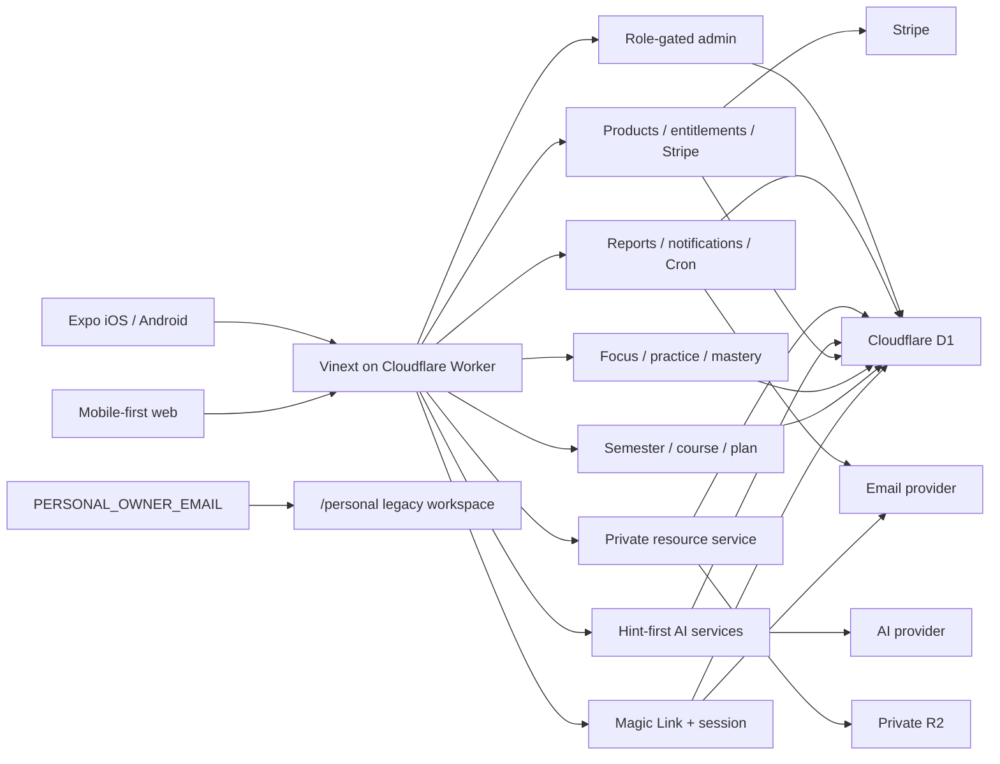

# DeepStudy Architecture

## Layers

- `app/`: web pages and thin HTTP route handlers.
- `apps/mobile/`: Expo Router presentation and typed API client.
- `src/application/`: authenticated use-case orchestration.
- `src/domain/planning/`: explainable priority, capacity, generation, and
  rebalancing rules.
- `src/domain/mastery/`: mastery score, review policy, intervals, and queue.
- `src/domain/commerce/`: product catalogue and entitlement rules.
- `src/repositories/`: D1 SQL and ownership predicates.
- `src/services/`: AI, payment, email, resource validation, storage, usage, and
  security adapters.
- `src/infrastructure/`: Cloudflare runtime environment boundary.
- `db/` and `drizzle/`: strict schema and ordered migrations.
- `worker/`: fetch, asset/image handling, app-association responses, and Cron.

Pages never call Stripe, AI, R2, or email providers directly. HTTP routes parse
validated input, obtain an authenticated principal, invoke an application
service, and return the common API error shape.

## Open-course invariant

`courses.course_name` is the only required course identity. Course code,
institution template, instructor, and timetable are optional. Planning,
practice, mastery, AI context, resources, reports, and notifications use owned
course/topic IDs and do not branch on the original `math`, `physics`, `c`, or
`eee` identifiers.

UTS Spring 2026 and four courses are starter templates only.

## Identity and isolation

Raw Magic Link/session tokens are random and stored only as SHA-256 hashes.
Web uses `HttpOnly`, `SameSite=Lax`, production-`Secure` cookies. Native
exchanges a single-use Magic Link token for a bearer session stored in
Keychain/Keystore-backed SecureStore.

Every student repository method accepts the authenticated user ID. Child
creation often uses `INSERT ... SELECT` from an owned parent. Cross-user and
missing resources deliberately share a `404` response.

## Learning loop

The server owns focus start/end, practice session state, hint count, failed
checks, answer scoring, mastery, and retest scheduling. The first wrong answer
does not reveal a solution or update mastery. Completed attempt + mastery +
retest + product event use a D1 batch.

Mastery is evidence-based and displayed in bands, not as a falsely precise
promise. Review policy is configurable domain code, not UI constants.

## Commerce boundary

The browser submits a product key only. The server owns price, currency,
Stripe Price ID, access period, webhook validation, purchase status, and
entitlement. Feature flags and entitlement checks run inside restricted
services/APIs.

## AI/resource boundary

AI providers implement a typed interface. User resources are private,
ownership-checked, size-limited, and passed as explicitly untrusted context.
Extraction returns proposals; no mass course data is inserted before explicit
confirmation.

## Notifications and operations

The hourly Worker Cron generates time-zone-aware reminders, creates deduplicated
delivery records, retries email, cleans deleted resources, and stores a job
result. Marketing remains off by default. Email unsubscribe uses an expiring
HMAC token.

Admin pages and APIs require the admin role server-side. They expose aggregate
operations, not default full private-resource/transcript access.

## Feature flags

Flags are environment-scoped D1 overrides. Preview/production defaults are
fail-closed for external integrations and hidden products. This allows
deploying compatible schema/code before enabling payments, uploads, AI,
reports, or admin access.

## Personal workspace

The original four-course experience remains web-only at `/personal`. The route
uses the normal authenticated session plus exact server-side
`PERSONAL_OWNER_EMAIL`, fails closed when blank, returns `404` to other users,
and emits `noindex`/`nofollow`.

Its legacy same-origin `localStorage` progress is not copied into D1 templates
or exposed to SaaS users.

## Failure and rollback

Provider adapters return explicit unavailable errors when credentials/bindings
are missing. API errors contain a safe code/message/request ID rather than
provider secrets or SQL stacks. Schema rollback is forward-compensating, and
the Worker must remain compatible with at least the previous native binary.

