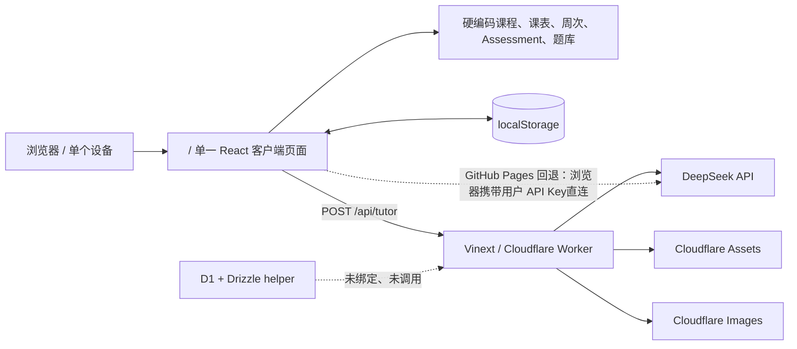
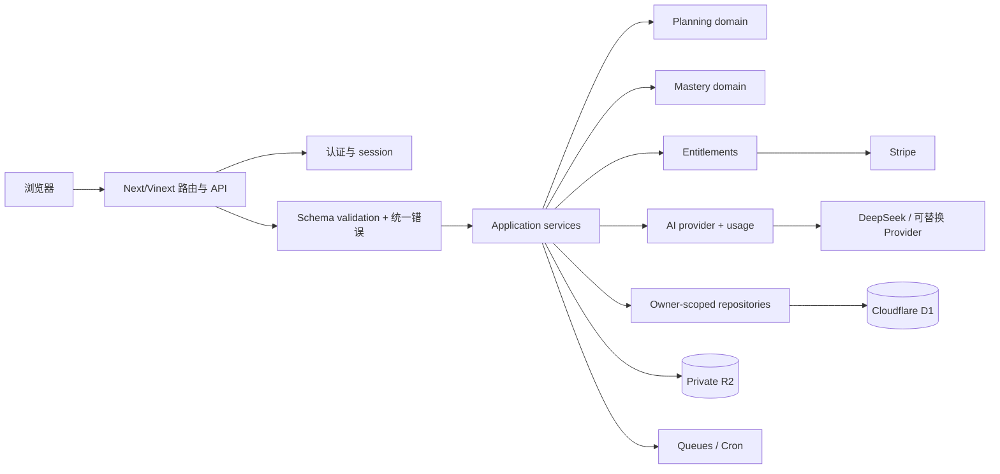

# DeepStudy Phase 0 代码库审计

> Milestone 1 follow-up (2026-07-30): production dependency findings recorded
> during Phase 0 were remediated with compatible PostCSS/Sharp overrides.
> `npm audit --omit=dev` now reports 0 vulnerabilities. Development-tool
> advisories remain tracked separately in `docs/MILESTONE_1_REPORT.md`.
>
> 审计日期：2026-07-30  
> 审计对象：当前工作区、当前线上 Workers 版本、现有 Sites 项目元数据  
> 审计性质：只读分析与基线验证；除本文件和根目录规格文件外，未修改产品代码  
> 规格来源：[`COMMERCIALIZATION_SPEC.md`](../COMMERCIALIZATION_SPEC.md)

## 1. 执行摘要

当前项目不是一个“缺少几个页面的 SaaS”，而是一个功能较丰富、主要依靠前端状态和浏览器 `localStorage` 的单用户学习应用：

* 已有的学习体验有保留价值：今日单一主任务、课前/课后/延迟回忆节奏、原创题库、作答证据工具、Hint-first AI 导师、双语界面和移动端底部导航。
* 当前不存在真正投入使用的用户数据库、身份验证、服务端用户数据、租户隔离、课程 CRUD、Assessment CRUD 或 Onboarding 路由。
* 四门课程、个人课表、教室、Canvas/Zoom 地址、Spring 2026 周次和 Assessment 全部硬编码在客户端包内。
* 学习进度、笔记、信心、掌握状态和 48 小时复测依据都保存在当前设备的 `localStorage` 中，无法跨设备同步，也不存在用户归属。
* D1/Drizzle 的空壳和 Cloudflare Worker 入口已经存在，但 D1、R2、KV、Queues、Cron、Durable Objects 和 Turnstile 均未实际接入。
* 线上 `/api/tutor` 是公开、未认证的 AI 代理；现有限流是单进程内存 Map，不能作为商业服务的成本控制。
* 当前生产依赖审计发现 3 个 high 严重级别条目，均可通过测试兼容性后升级 Next.js 修复。
* 当前构建、TypeScript、lint 和 22 个现有测试均通过，但测试集中在题库内容和前端源代码断言，不能证明身份、数据库或隔离安全。

结论：**保留现有技术栈和核心学习模块，先建立身份、D1 数据边界和服务端所有权检查，再逐步把单用户静态数据迁移为模板与用户数据。没有理由重写成其他框架或微服务。**

## 2. 审计范围与基线

### 2.1 审计过的关键表面

* 应用入口与路由：`app/`
* 课程、课表和 Assessment：`app/personal/four-course-app.tsx`、
  `app/semester-data.ts`
* 练习与掌握逻辑：题库文件、`app/question-progress.ts`、`app/tutor-mastery.ts`
* AI 调用：`app/api/tutor/route.ts` 和客户端回退逻辑
* 数据库骨架：`db/`、`drizzle/`
* Worker 和 Cloudflare 配置：`worker/`、`wrangler.jsonc`、`.openai/hosting.json`
* 静态 GitHub Pages 构建：`static-site/`、`.github/workflows/pages.yml`
* 环境变量、构建脚本、测试和 TypeScript 配置
* 当前线上版本：<https://uts-deep-study.dqq12125-study.workers.dev/>
* 现有 Sites 项目：存在一个独立、仅所有者可访问的 Sites 部署，与公开 Workers URL 不是同一发布地址

### 2.2 当前工作区状态

审计开始时工作树已经包含大量未提交修改和未跟踪文件，包括题库、作答工作区、视觉组件、测试和 CSS。它们不是本次审计创建的内容。

这带来两个直接风险：

1. 当前可运行状态并不等于 Git `HEAD` 可复现状态。
2. 后续商业化修改前必须先由项目所有者确认哪些现有改动应进入基线提交，否则数据库和路由改造会与正在进行的学习功能修改混在一起。

本审计以**当前工作树实际可构建状态**为准，而不是仅以 `HEAD` 为准。

### 2.3 验证结果

| 检查 | 命令/方法 | 结果 |
|---|---|---|
| 生产构建 | `npm run build` | 通过；仅有客户端 chunk 大于 500 kB 警告 |
| TypeScript | `npx tsc --noEmit` | 通过 |
| Lint | `npm run lint` | 通过 |
| 现有测试 | `node --test "tests/*.test.mjs"` | 22/22 通过 |
| 线上首页烟雾检查 | Chrome + DOM 检查 | 正常呈现单用户 Today 页 |
| 响应式初筛 | 320、375、390、430、768、1024、1440 px | Today 首屏未发现横向溢出；可见交互目标未小于 44 px |
| 生产依赖审计 | `npm audit --omit=dev` | 3 个 high 条目，0 个 critical |
| 线上安全响应头 | HTTP 响应头检查 | 未发现 CSP、HSTS、`X-Content-Type-Options`、Referrer-Policy、Permissions-Policy |

注意：响应式检查只覆盖当前 Today 首屏，不等于完整的跨页面、键盘、屏幕阅读器或 iOS Safari 验收。

## 3. 当前技术栈

| 层 | 当前实现 | 审计结论 |
|---|---|---|
| UI | React 19.2.6、Next 16.2.6 App Router API、单一大型客户端页面 | 可保留 React/Next 接口，但必须拆分路由和数据边界 |
| Cloudflare 适配 | Vinext 0.0.50、Vite 8.0.13 | 已能构建 Cloudflare Worker ESM，优先保留 |
| 运行时 | Cloudflare Worker + Assets + Images | 可保留 |
| 数据访问 | Drizzle ORM 0.45.2 的 D1 helper | 只有骨架；没有 schema、迁移或调用 |
| 数据库 | 未启用 | `.openai/hosting.json` 中 `d1: null`；Wrangler 也未声明 DB |
| 文件存储 | 未启用 | `.openai/hosting.json` 中 `r2: null` |
| 缓存/异步 | 无 KV、Queues、Cron、Durable Objects | 后续按功能逐项接入，不应一次全开 |
| AI | DeepSeek Chat Completions，服务端代理；GitHub Pages 环境存在浏览器直连回退 | 教学 prompt 可保留，调用层需重构 |
| 样式 | Tailwind CSS 4 导入 + 约 4,376 行全局 CSS + token 文件 | 视觉方向可保留，样式边界需要收敛 |
| 测试 | Node 内置 test runner | 可保留现有内容测试；需新增真正的 integration/E2E |
| TypeScript | `strict: true`、`noEmit: true` | 已开启严格模式；`allowJs: true`、`skipLibCheck: true` 仍需记录 |

## 4. 当前架构图



### 当前请求边界

* Worker 入口：`worker/index.ts`
* 页面请求：交给 `vinext/server/app-router-entry`
* 图片请求：`/_vinext/image` 由 Cloudflare Images 转换
* 唯一业务 API：`POST /api/tutor`
* 所有其他学习操作：客户端状态变更和 `localStorage` 写入

因此当前没有“服务端写操作”的业务边界，也没有可以执行 `userId` 检查的持久化查询。

## 5. 当前路由结构

构建产物只识别两个应用路由：

```text
/
└── 通过客户端 view 状态切换：
    ├── today
    ├── plan
    ├── courses
    ├── tutor
    └── quiz

/api/tutor
```

不存在以下规格要求的真实路由：

* `/auth/*`
* `/onboarding`
* `/app/today`
* `/app/plan`
* `/app/courses`
* `/app/courses/:courseId`
* `/app/practice`
* `/app/tutor`
* `/app/mastery`
* `/app/settings/*`
* `/admin`
* `/legal/*`

当前底部导航按钮只修改 `view` state，不更新 URL；浏览器历史、深链接、服务端保护和按路由代码拆分都无法使用。

## 6. Cloudflare、部署与环境配置

### 6.1 当前 Worker 配置

`wrangler.jsonc` 当前声明：

* Worker 名称：`uts-deep-study`
* Worker 入口：`worker/index.ts`
* 静态资源：`dist/client`
* Cloudflare Images binding：`IMAGES`
* Assets binding：`ASSETS`

没有声明：

* D1
* R2
* KV
* Durable Objects
* Queues
* Cron Triggers
* Turnstile

`worker/index.ts` 的 `Env` 类型把 `DB` 写成必填，但实际 Wrangler 和 Sites 都未提供 DB；当前之所以不报错，是业务代码没有调用它。这是类型与运行时配置不一致。

### 6.2 Sites 配置

`.openai/hosting.json` 已包含既有 `project_id`，但：

```json
{
  "d1": null,
  "r2": null
}
```

Sites 中已有版本 1，当前访问策略是仅项目所有者可访问。它的 Sites URL 与用户给出的公开 `workers.dev` URL 不同。

### 6.3 第二套 GitHub Pages 发布

仓库还包含：

* `npm run build:pages`
* `vite.pages.config.ts`
* `.github/workflows/pages.yml`
* `static-site/`

这套流程把同一个客户端页面发布为纯静态站，并因此保留了让用户在浏览器填写 DeepSeek API Key 的回退。

风险：

* Workers、Sites 和 GitHub Pages 三条发布路径可能出现版本漂移。
* 身份、数据库和服务端 entitlement 上线后，纯静态版本不能保持同等安全能力。
* README 仍称项目是 starter，并声称不使用 `wrangler.jsonc`，与现实不符。

商业化改造前应选定一个权威生产发布路径；建议以 Cloudflare Worker/Sites 能力路径为主，GitHub Pages 只保留文档或退役。

### 6.4 当前环境变量

`.env.example` 只包含：

```text
DEEPSEEK_API_KEY=
```

未发现已提交的真实密钥。`.gitignore` 会忽略 `.env*`，但保留 `.env.example`，这是正确的基础设置。

## 7. 当前数据保存方式

### 7.1 静态源代码数据

以下数据直接打包进浏览器：

* 四门课程及课程代码
* 课程主题和课程简介
* Canvas 课程 ID 与链接
* Zoom/online class 入口
* 个人课表、日期、教室、地址和地图链接
* Spring 2026 周次范围和假期
* 23 条 Assessment/里程碑
* 周学习计划
* 基础题、主题题、难度题、教师风格原创题
* 深度讲解和评分 rubric

### 7.2 浏览器 `localStorage`

当前使用的 key：

| Key | 内容 | 商业化后的归属 |
|---|---|---|
| `four-course-language` | 界面语言 | `users` / `user_settings` |
| `four-course-plan-checks` | 周任务勾选状态 | `study_tasks` |
| `four-course-plan-notes` | 计划笔记 | 用户私有 task/note 数据 |
| `four-course-confidence` | 主题信心 | `mastery_records` 或 attempt 证据 |
| `four-course-mastery` | 主题“已掌握”列表 | 迁移时只能作为低可信历史；不能直接成为正式 mastery 分数 |
| `four-course-session-completions` | 学习 session 完成记录 | `focus_sessions` / `study_tasks` |
| `four-course-session-takeaways` | 学习总结 | 用户私有 session 数据 |
| `four-course-resume-v2` | 恢复位置 | 用户/设备偏好，可服务器同步 |
| `four-course-question-progress-v1` | 题目尝试及掌握标记 | `practice_attempts` + `mastery_records` |
| `four-course-deepseek-key` | 用户填写的 DeepSeek API Key | 必须删除；不得迁移 |

`localStorage` 只适合作为设备级 UI 偏好或短期草稿，不能继续作为课程、进度和掌握度的权威数据源。

## 8. 硬编码个人数据清单与迁移分类

### 8.1 应迁移为数据库中的用户数据

| 当前数据 | 当前位置 | 原因/目标 |
|---|---|---|
| 个人课表的星期、时间、活动类型 | `app/semester-data.ts:54` 起 | 写入 `class_sessions`，每条必须带 `user_id` 和 `course_id` |
| 教室 `CB04.03.551`、`CB06.03.028`、`CB10.02.470`、`CB11.11.402`、`CB11.B1.100`、`CB10.03.460` | `app/semester-data.ts:56-89` | 属于具体学生选中的 class allocation，不应是公共模板默认课表 |
| `ONLINE058`、`ONLINE060`、预录活动编号 | `app/semester-data.ts:72-81` | 同上 |
| Canvas course IDs `40822`、`41070`、`41072`、`41382` | `app/personal/four-course-app.tsx` 等 | 可能与具体学期/班级/个人访问有关；不得作为跨用户公共链接 |
| Zoom/external tool/item 链接 | `app/personal/four-course-app.tsx`、`app/semester-data.ts` | 应为用户私有课程链接，或不保存 |
| 23 条 Assessment、日期、权重、备注、Canvas 链接 | `app/semester-data.ts:267-290` | 写入 `assessments`，用户确认后创建 |
| 当前任务、队列、周任务勾选 | `app/personal/four-course-app.tsx` + `localStorage` | 写入 `study_tasks`；服务端按用户生成/更新 |
| 学习笔记、session takeaway | `localStorage` | 用户私有记录 |
| 题目作答、正确性、提示使用、用时 | 当前只保存部分进度 | 写入 `practice_attempts` |
| 主题信心与掌握状态 | `localStorage` | 写入 `mastery_records`，并重新按证据计算 |
| 48 小时复测到期状态 | 客户端派生 | 写入 `next_review_at` 和 `study_tasks` |
| 恢复位置 | `localStorage` | 可保留设备级缓存，但服务端数据才是权威状态 |

### 8.2 应迁移为课程模板

| 当前数据 | 当前位置 | 模板边界 |
|---|---|---|
| 33130 Mathematics 1 | `app/personal/four-course-app.tsx` | `course_templates` |
| 48510 Introduction to Electrical and Electronic Engineering | `app/personal/four-course-app.tsx` | `course_templates` |
| 48430 Fundamentals of C Programming | `app/personal/four-course-app.tsx` | `course_templates` |
| 68037 Physical Modelling | `app/personal/four-course-app.tsx` | `course_templates` |
| 课程默认主题目录 | `app/personal/four-course-app.tsx`、`app/semester-data.ts` | 作为模板 topics，复制/关联到用户课程 |
| 通用课程学习策略（预习、课后、完成标准） | `makePlan()` | 作为可版本化模板规则，不绑定具体学生日期 |
| 原创公共题库 | 多个 `*-question-bank.ts`、`topic-questions.ts` | 作为 `practice_questions` 公共原创题；需记录来源和 review 状态 |
| 深度讲解、rubric、视觉意图 | `deep-lessons.ts` 等 | 作为模板内容或可版本化静态内容 |
| 课程颜色与符号 | `app/personal/four-course-app.tsx` | 可作为模板默认值，用户课程可覆盖 |

公共模板中**不得包含**个人 Canvas/Zoom 链接、个人教室安排或从私人上传资料生成的题目。

### 8.3 应迁移为用户设置

| 当前数据 | 当前状态 | 目标 |
|---|---|---|
| 语言 | 默认 `zh`，保存于 `localStorage` | `preferred_language` |
| 时区 | 隐式依赖浏览器本地时区 | 明确保存 IANA timezone，默认 `Australia/Sydney` |
| 默认专注时长 | 固定 25 分钟 | `daily_study_minutes` 和设备级 timer preset |
| 每日学习容量 | 未实现 | `user_settings.daily_study_minutes` |
| 学习开始时间、周起始日、提醒 | 未实现 | `user_settings` |
| AI 解释语言、Academic Integrity mode | 仅部分由界面语言/prompt 决定 | `user_settings` |

### 8.4 可以继续作为静态 UI 文案

* 通用导航名称、按钮、空状态和错误提示
* “今天最重要的一步”“完成标准”等产品文案
* Hint-first 和 Academic Integrity 固定提示
* 题型、难度、错误类型、状态的双语标签
* 通用专注计时器预设名称
* 非 UTS 官方的 DeepStudy 品牌文案

这些文案应从当前超大 `ui` 对象拆到结构化 i18n 资源，但不需要进入关系数据库。

## 9. 当前核心学习逻辑

### 9.1 今日任务

`app/personal/four-course-app.tsx` 在客户端即时组合任务：

1. 7 天内 Assessment
2. 当前正在上课的活动
3. 课前预习或课后复习
4. 上次学习位置
5. 上周未完成的 delayed recall
6. 48 小时复测
7. 本周固定学习计划
8. 固定 fallback 题目

然后按一个小整数 `priority` 排序，显示第一项和后续三项。

优点：

* 已经实现“一个当前任务 + 最多三项队列”的产品原则。
* 推荐原因可从 task meta 中看到。

限制：

* 规则与 UI、静态数据和浏览器时间耦合在同一组件。
* 没有每日容量、Assessment 权重、掌握风险或可解释评分模型。
* 没有服务端持久化、幂等生成或重新排程。
* 用户修改设备时间或时区会直接改变结果。

### 9.2 练习系统

当前优点：

* 33 个主题，每个主题 10 道难度标注题；现有测试会验证题目数量和答案位置分布。
* 有原创 instructor-style 问题、rubric、作答工具和视觉辅助。
* 正确选项后不会自动判定掌握；还要求显式掌握决定。
* AI 导师的掌握判定会排除 H5 完整答案、缺乏推理和非新迁移题。

当前限制：

* 正确性、掌握状态与题库内容都在客户端，用户可以任意改写 `localStorage`。
* 没有 `practice_attempts` 事实表，没有提示次数、用时、信心前后等完整证据。
* 当前的手动“已掌握”仍不能满足规格所要求的 0–100 证据模型。
* 公共原创题与未来用户资料生成题还没有所有权字段或访问边界。

### 9.3 48 小时复测

当前实现把 session key 记录为本地日期字符串，然后用：

```text
当日本地时间 23:59:59 + 48 小时
```

来判断是否生成复测卡。

问题：

* 实际间隔可能接近 48–72 小时，而不是从完成时刻起约 48 小时。
* 只在页面打开时计算；没有后台任务、邮件或站内通知持久化。
* 依赖设备时区和本地时间，没有 UTC 存储。
* 夏令时切换时以毫秒加 48 小时，不等同于用户日历中的“后天同一时间”。
* 用户清理浏览器数据或更换设备后复测记录丢失。

该逻辑可作为产品行为原型，但必须迁移到独立 mastery/review domain，并由 D1 的 `next_review_at` 驱动。

### 9.4 专注计时器

当前每秒执行一次 `setInterval` 并将 `seconds - 1`。

当标签页进入后台、手机锁屏或浏览器节流 timer 时会失准。商业版应保存 `started_at` 和目标结束时间，用 `Date.now()` 差值重算显示值，而不是信任 interval 次数。

## 10. 中英文实现

当前实现：

* `Lang = "zh" | "en"`
* 页面内部大型 `ui` 对象保存双语文案
* 内容数据使用 `{ zh, en }`
* 默认语言固定为中文
* 切换后写入 `four-course-language`
* hydration 后动态修改 `<html lang>`

优点：

* 核心学习内容已经有较完整的双语结构。
* 英文和中文不是机器运行时即时翻译。

问题：

* 文案、业务逻辑和 JSX 集中在一个 3,343 行客户端组件。
* 服务端初始文档始终是 `zh-CN`，不能按登录用户设置渲染。
* 只有两种语言值，没有统一 locale 模块、fallback、日期/数字/货币策略。
* Assessment 既保存 ISO date 又保存手写 `displayDate`，容易产生语言和时区不一致。

## 11. AI 服务审计

### 11.1 当前调用位置

1. 服务端：`app/api/tutor/route.ts` 调用 DeepSeek。
2. 客户端回退：GitHub Pages 场景允许用户填写 DeepSeek API Key，并由浏览器直接调用 DeepSeek。

### 11.2 可保留部分

* Hint level H0–H5 约束
* 一次只推进一个认知步骤
* 要求识别正确片段和单一缺口
* 完整答案后要求新迁移题
* 数学/物理的符号、单位和合理性检查
* C 语言的类型、控制流、内存和边界检查
* 对作答证据的字段级长度限制

### 11.3 必须重构部分

* 页面组件不能继续直接知道 provider URL、model key 或 API Key。
* 需要 `AiProvider` 抽象、usage service、entitlement、统一错误和审计事件。
* 上传内容必须明确标记为不可信上下文。
* 必须记录 token/延迟/成本元数据，但不能把完整私人资料写进普通日志。
* GitHub Pages 的浏览器 API Key 回退必须移除。

## 12. 安全问题与优先级

### P0：进入多用户开发前必须解决

#### S-01 无身份与授权边界

当前所有人都看到同一套数据；`chatgpt-auth.ts` 只是未使用的 starter helper。没有 API 或页面调用它，也没有 app-owned Student 账户。

影响：

* 无法建立 `userId`。
* 无法实现数据隔离、付费 entitlement、删除/导出和管理员角色。

#### S-02 客户端保存第三方 AI API Key

`four-course-deepseek-key` 被保存到 `localStorage`，并用于浏览器直连 DeepSeek。

影响：

* 任意同源 XSS、浏览器扩展或共享设备用户可读取该 Key。
* 无法做服务端用量限制、成本归属和统一安全策略。

处理：商业版删除该能力，不迁移现有 Key。

#### S-03 AI API 未认证且限流不可依赖

`/api/tutor`：

* 不要求登录。
* 每 IP 每小时 40 次只存于单 Worker isolate 的 `Map`。
* isolate 重启或横向扩展后计数丢失。
* 本地/非 Cloudflare 请求会信任 `x-forwarded-for`。
* 没有产品套餐、用户、每日/月度成本或异常用量限制。

这是直接的成本滥用风险。

#### S-04 生产依赖存在 high 漏洞

审计时使用的 Next.js 为 16.2.6。`npm audit --omit=dev` 报告：

* Next App Router middleware/proxy bypass
* App Router Server Actions DoS
* 自定义 server/rewrites 相关 SSRF
* Next 传递依赖中的 PostCSS 文件读取/路径穿越问题
* Sharp/libvips 继承漏洞

`npm audit` 建议可升级到 Next 16.2.12，且不是 semver major。由于项目依赖 Vinext，升级前仍必须在独立小改动中验证 Vinext 构建、Worker runtime、图片优化和现有测试。

### P1：Milestone 1 内解决

#### S-05 API 没有 schema validation

当前只有手写的 `clean()`、类型判断和截断，没有 Zod/Valibot 等 schema。`request.json()` 在字段截断前会解析完整 body，也没有 Content-Length/请求体上限。

#### S-06 上游错误可能透传给用户

DeepSeek 返回非 2xx 时，代码会把 `payload.error.message` 直接作为 502 响应。上游内部细节不应直接暴露；商业版应映射为稳定错误码，并通过 request ID 在私有日志中定位。

#### S-07 缺少统一安全响应头

线上首页未观察到：

* Content-Security-Policy
* Strict-Transport-Security
* X-Content-Type-Options
* Referrer-Policy
* Permissions-Policy
* `frame-ancestors` 防嵌入策略

需要根据 AI、Stripe、字体和图片来源设计 CSP，而不是盲目复制。

#### S-08 私人/具体班级链接打包为公共数据

Canvas course ID、external tool 和 module item 链接会进入所有用户的客户端 bundle。即使这些链接仍需要 UTS 登录，它们也不应成为跨用户模板数据。

#### S-09 没有统一日志、request ID 和错误边界

当前 API 返回 `{ error: string }`，不符合规格中的统一错误格式；也没有结构化日志、隐私过滤或 request ID。

### P2：随相关功能上线

* 所有写操作的 CSRF 策略
* 登录、注册和密码重置限流
* Turnstile 风险控制
* 文件 MIME、magic bytes、大小、恶意内容和配额验证
* R2 私有访问和短期签名 URL
* Stripe webhook 签名和幂等
* Admin 支持访问的审计流程
* 数据导出、软删除、后台物理删除和保留期

## 13. 数据迁移风险

### 13.1 匿名本地数据没有稳定用户归属

现有 `localStorage` 数据无法证明属于哪个邮箱。首次登录时如果提供导入，应：

1. 明确显示将导入哪些本地数据。
2. 只允许导入到当前已验证账户。
3. 使用一次性、幂等 migration marker。
4. 不把 `four-course-deepseek-key` 发送到服务器。
5. 将旧手动 mastery 标记视为“历史自评”，不能直接转成高 mastery。

### 13.2 题目 ID 和模板版本

尝试记录依赖字符串 question ID。未来编辑题目时必须：

* 保持稳定题目 ID，或建立题目版本表。
* 不因文案更新把旧 attempt 关联到另一道题。
* 公共模板题与用户私有生成题明确区分 owner。

### 13.3 时间语义

当前数据混用：

* 无时区的 `YYYY-MM-DD`
* 带 `+10:00` / `+11:00` 的 ISO 字符串
* 手写双语显示日期
* 浏览器本地 `Date`
* `Date.now()` 毫秒

迁移时必须定义：

* 数据库存 UTC instant 的字段：`due_at`、`started_at`、`completed_at`、`next_review_at`
* 纯日历日期字段：学期 start/end date
* 纯本地时间字段：每周课表 start/end time
* 所有显示从 UTC/本地规则和用户 IANA timezone 计算，不保存重复 `displayDate`

### 13.4 数据库迁移与回滚

当前 Drizzle journal 为空。第一份迁移会成为生产数据契约，必须：

* 生成可重复执行、受版本控制的 SQL migration。
* 先做 additive schema，再切换读路径，最后切换写路径。
* 在删除旧字段或旧 `localStorage` 兼容前保留至少一个回滚版本。
* 为每次迁移准备 D1 备份/导出和明确的应用版本兼容窗口。

## 14. 移动端与无障碍审计

### 14.1 已有优点

* Today 首屏在规格列出的七个宽度上未观察到横向页面溢出。
* 底部导航固定、最大宽度 520 px，适合移动端单手操作。
* 多数按钮最小高度 44 px；粗指针环境提升到 48 px。
* 表单相关 CSS 多处使用 16 px 字号，降低 iOS 自动缩放风险。
* 有 `env(safe-area-inset-bottom)`。
* 有全局 `prefers-reduced-motion` 降级。
* 当前导航、progressbar、状态和多数组件已有 accessible name/ARIA。
* 课程色不是唯一状态表达；正确/错误还包含文字和符号。
* 长文本使用 `min-width: 0`、`overflow-wrap` 和部分 ellipsis。

### 14.2 未验证或需修复的部分

* 没有 axe、Lighthouse accessibility 或真实屏幕阅读器自动化结果。
* 没有针对全部视图的 320–1440 px E2E；本次只验证 Today 首屏。
* 没有 iOS Safari 键盘弹出后 AI compose 的真机验证。
* 当前导航是按钮切换 state，不是可深链的真实导航链接。
* 页面内容大幅切换时没有统一焦点管理；屏幕阅读器用户可能不知道视图已改变。
* 某些动态结果只依靠局部 `role="status"`，缺少统一错误摘要。
* 没有暗色模式实现；当前只能确认浅色模式。
* 没有对中英文所有长文案做自动截断/溢出回归。

## 15. 性能与可维护性

### 15.1 当前规模

* `app/personal/four-course-app.tsx`：大型客户端组件，约 174 KB
* `app/globals.css`：4,376 行
* `app/answer-workspace.tsx`：1,411 行
* `app/question-visuals.tsx`：1,112 行
* 多个题库文件约 600–1,100 行

当前所有页面状态、Today 规则、课程 UI、Tutor 和 Practice 主要集中在一个客户端组件。

### 15.2 构建产物

* 主页面客户端 chunk：约 581.9 KB（minified，构建工具发出 >500 KB 警告）
* framework chunk：约 185.4 KB
* 当前 `og.png`：约 1.34 MB
* `dist/` 总计约 8.68 MB

主要原因是静态课程内容、题库、视觉组件和全部视图一次进入客户端 bundle。

建议：

* 先按真实路由拆分，不做无目标的组件重写。
* 公共模板数据由服务端/D1按需读取。
* 大题库按课程或练习 session 动态加载。
* 将 UI、domain、repository 和 service 分层。
* 继续保留纯函数并扩大单元测试，而不是把所有逻辑塞入 route handler。

## 16. 测试覆盖审计

### 16.1 已有测试覆盖

22 个通过的测试主要验证：

* 数学答案和解释一致
* 周计划 topic ID 映射
* 题目答案位置分布
* AI Hint-first / one-gap prompt 契约
* 原创难度题数量、rubric 和作答工具
* 作答证据是否有意义并按问题隔离
* H5 完整答案不计入掌握
* question progress normalization
* SSR 返回首页 HTML

这些测试有价值，应保留为内容和教学逻辑回归。

### 16.2 当前缺口

不存在真实覆盖：

* 注册、登录、邮箱验证、忘记密码和 session 过期
* D1 migration 与 repository
* user semester/course/assessment CRUD
* 所有权查询和跨用户 403/404
* Onboarding
* Today plan 服务端生成
* 多设备/会话
* 时区跨日和 DST
* API schema validation
* AI entitlement 和持久化用量
* Stripe webhook
* 数据导出/删除
* 浏览器 E2E

部分现有“integration”测试其实是读取源文件并正则断言，不应被当作 HTTP/数据库集成测试。

## 17. 可保留模块

| 模块 | 处理建议 |
|---|---|
| Cloudflare Worker + Vinext 构建结构 | 保留 |
| React/Next App Router 接口 | 保留，拆成真实路由 |
| Drizzle D1 helper | 保留并完善 binding/schema |
| `tokens.css` 与当前简洁学习视觉 | 保留设计方向 |
| `answer-workspace.tsx` | 保留，后续拆小组件并接 attempt 数据 |
| `question-visuals.tsx`、`learning-tools.tsx` | 保留 |
| 原创题库和 rubric | 保留为模板内容，补来源/版本/所有权 |
| `deep-lessons.ts` | 保留为模板学习内容 |
| `question-progress.ts` 的 normalization 思路 | 保留纯函数，重新定义正式 mastery 规则 |
| `tutor-mastery.ts` | 保留“完整答案不等于掌握”的规则 |
| Hint-first AI system prompt | 保留教学契约，迁移到 provider/service 层 |
| 双语 `{ zh, en }` 内容 | 保留内容，迁入 i18n/模板边界 |
| 现有 22 个测试 | 保留为回归基线 |

## 18. 需要重构的模块

| 当前模块 | 目标 |
|---|---|
| `app/personal/four-course-app.tsx` | 保留私人模式并逐步拆成小型 feature components |
| `const courses` | `course_templates` + 用户 `courses` |
| `semester-data.ts` | 模板 seed + 用户 `class_sessions`/`assessments` |
| `localStorage` 进度 | D1 repository；本地只保留非权威缓存/草稿 |
| 客户端 Today 规则 | `src/domain/planning/` 纯函数 + 服务端 orchestration |
| 48 小时复测 | `src/domain/mastery/` + UTC `next_review_at` |
| 客户端 timer 递减 | 基于 start/end timestamp 的计时 |
| `/api/tutor` | 身份、schema、entitlement、usage、provider、统一错误 |
| 浏览器 DeepSeek Key | 删除 |
| 页面内部 `ui` 文案对象 | 独立 i18n 资源 |
| 三条部署路径 | 选定权威 Workers/Sites 生产路径 |
| starter README | 在后续文档阶段完全重写 |

## 19. 预计新增数据库表

下表按阶段列出，不代表应在一次 migration 中全部创建。

### Milestone 1 必需

* `users`
* `user_settings`
* `auth_sessions`
* `email_verification_tokens`
* `password_reset_tokens`
* `institutions`
* `semesters`
* `user_semesters`
* `course_templates`
* `courses`
* `class_sessions`
* `assessments`
* `topics`
* `study_tasks`
* `usage_events`（只记录最小必要产品事件）
* `audit_logs`

`auth_sessions` 和两个 token 表是规格建议模型之外的必要认证实体。Token 数据库中只能保存 hash，不保存可直接使用的明文 token。

### Milestone 2

* `focus_sessions`
* `practice_questions`
* `practice_question_versions`（建议，为稳定历史解释）
* `practice_attempts`
* `mastery_records`
* `review_events` 或由 `study_tasks` 中 `retest` 表达

### Milestone 3

* `subscriptions`
* `purchases`
* `payment_webhook_events`（用于幂等）
* `product_entitlements` 或版本化服务端产品配置
* `feature_flags`

### Milestone 4

* `learning_resources`
* `resource_extractions`
* `processing_jobs`
* `ai_conversations`
* `ai_messages`
* `ai_usage_records`

### Milestone 5 / 通知

* `notification_preferences`
* `notifications`
* `notification_deliveries`
* `scheduled_job_runs`

最终命名和拆分应在 `docs/MIGRATION_PLAN.md` 与数据库设计评审中冻结。

## 20. 预计新增 bindings 与环境变量

### Cloudflare bindings（不是普通字符串 secret）

* `DB` — D1
* `UPLOADS` — R2
* `RESOURCE_PROCESSING_QUEUE` — Queue（Milestone 4）
* 可选 KV binding — 只用于低敏配置/缓存，不用于用户权威数据

### Milestone 1 预计变量

* `APP_BASE_URL`
* `AUTH_SESSION_SECRET`（如果选择 app-owned session）
* `EMAIL_PROVIDER`
* `EMAIL_API_KEY`
* `EMAIL_FROM`
* `TURNSTILE_SECRET_KEY`
* `PUBLIC_TURNSTILE_SITE_KEY`
* `IP_HASH_SECRET`

身份方案尚未在 Phase 0 中最终冻结。Cloudflare Access 和当前 Sites SIWC 不适合直接充当面向普通 UTS 学生的公共 SaaS 注册系统；应在下一份迁移计划中比较“成熟的外部身份服务”与“D1 app-owned Email + password/magic link”并完成 Workers 兼容性 POC。

### AI

* `DEEPSEEK_API_KEY`（已存在）
* `AI_PROVIDER`
* `AI_TUTOR_MODEL`
* `AI_EXTRACTION_MODEL`
* `AI_COST_LIMIT_MONTHLY_MINOR` 或等价服务端配置

### Stripe

* `STRIPE_SECRET_KEY`
* `STRIPE_WEBHOOK_SECRET`
* `STRIPE_FOUNDING_PASS_PRICE_ID`
* `STRIPE_SEMESTER_PASS_PRICE_ID`
* `STRIPE_EXAM_SPRINT_PRICE_ID`
* `PUBLIC_STRIPE_PUBLISHABLE_KEY`

### 运行环境与管理

* `APP_ENV`
* `ADMIN_BOOTSTRAP_EMAILS`（仅用于一次性、受审计 bootstrap；不能长期作为唯一 RBAC）
* 可观测性服务 DSN/API Key（选型后）

所有 Hosted runtime secret 必须由部署平台管理；不得写入 `wrangler.jsonc`、Git 或客户端 bundle。

## 21. 建议的目标边界



关键约束：

* route handler 不直接拼 SQL。
* repository 方法必须显式接收 `userId`，并在 SQL 条件中使用。
* 模板读取与用户数据读取使用不同 repository/查询。
* entitlement 在服务端 application service 或 route 边界执行。
* AI、支付和上传都使用 adapter，测试环境提供明确 mock。

## 22. 分阶段改造建议

### Phase 0（本轮）

* 冻结规格。
* 完成代码、数据、部署、测试和安全审计。
* 不修改现有产品逻辑。

### Phase 0.5：建立可安全演进的基线

* 先整理并提交当前未提交工作树。
* 选定权威生产部署路径。
* 升级并验证存在安全公告的生产依赖。
* 增加统一 API error/request ID 基础。
* 冻结 auth 选型和 D1 migration 约定。

### Milestone 1：SaaS 基础

按可回滚的 vertical slice 实施：

1. D1 binding + 最小 migration + institution/course template seed
2. 身份/session
3. owner-scoped repository 和隔离测试
4. user semester
5. course CRUD
6. assessment CRUD
7. onboarding
8. 服务端生成的动态 Today
9. 旧单用户页面保留为受 feature flag 控制的 demo，直到新 Today 验收

### Milestone 2–5

严格按规格推进，不在 Milestone 1 预建 Stripe、R2、复杂 Admin 或 AI 上传功能。每个外部系统先以 adapter/mock 建立测试边界，再接真实 secret。

## 23. 回滚原则

Phase 0 没有运行时改动，不需要生产回滚。

后续阶段建议：

* Schema 先 additive，避免同版本删除字段。
* 新旧 Today 路由以 feature flag 切换。
* 旧静态四课体验在 Milestone 1 验收前作为只读 demo 保留。
* 每次 D1 migration 前创建可恢复备份。
* 认证切换必须能关闭新注册但保留已有 session 的安全登出路径。
* Stripe/R2/AI 均通过 adapter 和 feature flag 隔离，可在外部服务异常时降级。

## 24. Phase 0 结论与进入 Milestone 1 的门槛

在开始 Milestone 1 前应先确认：

1. 当前未提交的大量学习功能改动是否作为正式基线保留。
2. 生产权威路径是公开 Cloudflare Worker/Sites，而不是继续维护等价的纯静态 GitHub Pages SaaS。
3. 公共学生身份系统选型。
4. D1 数据库和 migration 命名约定。
5. 是否向现有个人用户提供一次性本地进度导入；若提供，明确低可信 mastery 处理规则。
6. 先升级并验证 Next/Vinext 安全补丁。

完成这些决策后，再编写 `docs/MIGRATION_PLAN.md` 和 Milestone 1 文件级实施计划。当前审计不应被解释为 Milestone 1 已经开始。
