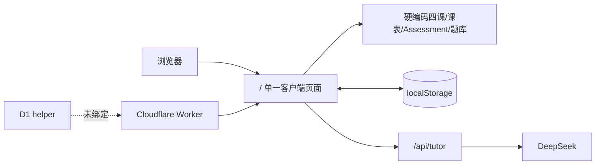
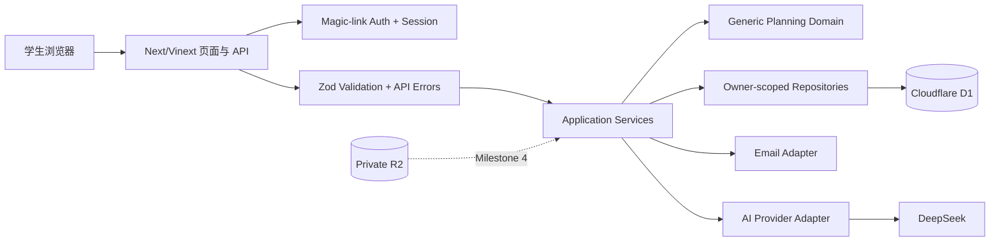

# DeepStudy 最小迁移架构

> 状态：Milestone 1 已完成，Milestone 2 已在本地实现并验证  
> 日期：2026-07-30  
> 前置文档：[CODEBASE_AUDIT.md](./CODEBASE_AUDIT.md)  
> 产品增补：课程模板可选，任意课程是一等能力

## 1. 迁移目标

在不重写现有 React/Vinext/Cloudflare Worker 项目的前提下，把单用户静态应用迁移为：

* 有可靠用户身份和 session 的多用户应用；
* 以 D1 为权威数据源；
* 用户可以创建任意学校、任意学期和任意课程；
* 四门现有课程只是可选模板；
* 所有用户数据查询都显式限制 `user_id`；
* 没有模板的课程也能添加 Assessment 并生成 Today 计划；
* 任意课程都能创建私人练习、形成掌握度和复测任务；
* 旧四课应用暂时保留，直到新流程通过验收。

## 2. 当前架构



主要限制：

* 课程类型由 `math | eee | c | physics` 固定联合类型决定。
* 路由、数据、计划和 UI 在一个大型客户端组件内。
* 没有服务端所有权边界。
* 进度只能留在当前设备。

## 3. 目标架构



分层规则：

* `app/`：路由、页面和 HTTP 边界。
* `src/domain/`：不依赖 Cloudflare/React 的纯业务函数。
* `src/application/`：用例编排、事务顺序和所有权要求。
* `src/repositories/`：所有 SQL；用户数据方法必须显式接收 `userId`。
* `src/services/`：邮件、AI、用量等外部 adapter。
* `src/lib/`：validation、时间、session、错误等基础设施。
* `db/`：Drizzle schema、migration 和模板 seed。

## 4. 开放课程数据设计

### 4.1 模板与用户课程分离

`course_templates` 保存可选公共模板：

* 课程代码和名称
* 简介
* 默认语言
* 默认颜色
* 可选模板主题/原创题关联

`courses` 保存用户自己的课程：

* `course_template_id` 可空
* `course_code` 可空
* `course_name` 必填
* `user_id` 和 `user_semester_id` 必填
* `source_type` 为 `template | manual | imported`

业务逻辑只能以 `courses.id` 关联，不能以课程代码或旧字符串 ID 关联。

### 4.2 自定义学校

公共 `institutions` 首先只 seed UTS。

`user_semesters` 同时支持：

* `institution_id`：选择公共学校时填写；
* `institution_name`：保存用户确认的名称快照，自定义学校时使用。

第一阶段不允许普通用户直接污染公共 institution 目录。

### 4.3 通用 Today 生成

第一版只使用通用信号：

1. Assessment 截止紧迫度；
2. Assessment 权重；
3. 是否逾期；
4. 当日课程；
5. 用户每日容量；
6. 未完成任务；
7. 可选 topic/mastery 信号。

模板可以补充 completion criteria，但模板不存在时使用通用、可验证的标准。

## 5. 数据库选型

选择 Cloudflare D1：

* 与当前 Worker/Vinext 部署一致；
* 适合用户、课程、Assessment、任务和 attempt 的关系查询；
* 可以通过 Drizzle 生成可审查 migration；
* user ownership 可直接进入每条 SQL 的 `WHERE user_id = ?`。

Milestone 1 不使用 KV 作为用户数据源，也不提前启用 R2、Queues 或 Durable Objects。

## 6. 身份系统选型

Milestone 1 选择 app-owned Email magic link：

* 不保存密码，消除密码哈希、重置和弱密码风险；
* 用户点击链接即完成邮箱验证；
* D1 保存用户、token hash 和 session token hash；
* session cookie 使用 `HttpOnly`、`Secure`、`SameSite=Lax`；
* 登录申请统一返回消息，防止账户枚举；
* 邮件发送通过 adapter，测试使用 mock，生产需要人工配置邮件服务。

当前 Sites SIWC 仍可作为内部预览身份，但不作为面向所有学生的唯一注册方案，因为它会把产品使用资格绑定到 ChatGPT 身份。

兼容路由：

* `/auth/sign-up` 和 `/auth/sign-in` 都申请 magic link；
* `/auth/verify` 消费一次性 token；
* `/auth/forgot-password` 说明密码无须重置并引导申请新链接；
* `/auth/reset-password` 不接受密码，跳转到 magic-link 登录。

安全细节：

* 明文 token 只出现在一次性邮件 URL/cookie 中；
* 数据库只保存 SHA-256 token hash；
* token 有短过期时间并只能消费一次；
* session 可多设备存在并可单独撤销；
* 注册/登录速率限制持久化到 D1；
* 所有 authenticated write 检查 same-origin 和 session。

## 7. 文件存储选型

Milestone 1 不启用上传，因此 `.openai/hosting.json` 中 R2 保持 `null`。

Milestone 4 启用私有 R2 binding `UPLOADS`：

```text
users/{userId}/{resourceId}/{safeFileName}
```

D1 保存 metadata，下载经过授权 API 或短期签名 URL。

## 8. 支付集成点

Milestone 1 不接 Stripe，但提前保留清晰边界：

* course/AI/upload 等受限用例从 application service 调用 entitlement；
* Milestone 3 新增 Stripe adapter、checkout route、webhook route；
* 产品和价格由服务端配置；
* `payment_webhook_events` 保证幂等；
* 购买成功后在同一服务端流程更新 entitlement。

开放课程能力不与套餐绑定；套餐只限制数量或高级功能。

## 9. AI 服务层设计

当前 Tutor prompt 可保留，但 API 调用迁到：

```text
src/services/ai/
├── provider.ts
├── deepseek-provider.ts
├── tutor-service.ts
└── safety.ts
```

Milestone 1 只为现有 `/api/tutor` 增加未来接入点，不在本阶段重写 Tutor UI。

所有 provider 输入使用通用 `courseId`、`courseName` 和可选 topic；不得只接受四个旧课程 ID。

## 10. 迁移顺序

### Slice 1：安全可运行的数据基础

1. 增加 D1 logical binding。
2. 建立 Drizzle schema 和第一份 migration。
3. seed UTS、Spring 2026 和四个可选课程模板。
4. 增加 API error/request ID、Zod 和时间工具。
5. 增加 migration/schema 测试。

### Slice 2：身份和隔离

1. Magic-link token/service。
2. Session cookie/service。
3. Auth 页面/API。
4. owner-scoped repositories。
5. 用户 A/B 隔离集成测试。

### Slice 3：开放课程 Onboarding

1. 语言/时区。
2. 公共学校或自定义学校。
3. 模板课程或任意手动课程。
4. 可选课表。
5. 可选 Assessment。
6. 通用规则生成第一个 Today 计划。

### Slice 4：动态应用页面

1. `/app/today`
2. `/app/courses`
3. `/app/courses/:courseId`
4. 最小 Assessment CRUD
5. task complete/skip
6. `/personal` 所有者白名单保护和原四课组件独立保留

旧 `/` 页面在本里程碑保留为临时兼容入口，不成为新数据模型依赖。原四课
实现移入独立组件，未来替换公共根页面时不得覆盖 `/personal`。

### Slice 5：核心学习闭环（Milestone 2）

1. 增加 Focus、Practice Session、Attempt、Mastery D1 实体。
2. 首次错误只记录服务端重试状态，不返回正确答案、不提升掌握度。
3. 最小提示后再次作答，原子写入证据、掌握度和下一次复测。
4. 首次独立正确默认约 48 小时复测；支持后正确更早复测。
5. 到期复测进入 Today 的唯一当前任务候选。
6. 逾期任务按每日容量重新排程；Critical 任务需要显式确认。
7. `/app/practice`、`/app/mastery` 和 Today 专注计时器均使用通用
   `courseId`/`topicId`，不依赖四门旧课程。

## 11. 回滚方式

### Slice 1

* Schema 只新增表和 index。
* 应用仍可使用旧 `/` 页面。
* 回滚应用版本不会读取新表。

### Slice 2

* Auth 路由独立；feature flag 可关闭新注册。
* 撤销 session 不影响旧静态页面。
* token 表可保留，不需要破坏性 rollback。

### Slice 3

* 新 Onboarding 写入独立 D1 表。
* 旧四课数据不被删除或原地改写。
* 若新流程异常，可暂时关闭入口而保留已写数据。

### Slice 4

* `/app/*` 与旧 `/` 并存。
* 路由级 feature flag 可退回旧体验。
* migration 不在同一版本删除列或表。
* `/personal` 缺少白名单时默认拒绝；回滚 SaaS 页面不删除私人组件。

### Slice 5

* Milestone 2 表和 index 均为新增；旧页面没有相关记录时仍可渲染。
* 回滚应用时保留 Attempt、Mastery 和复测记录，不执行破坏性 drop。
* 复测策略位于代码配置，可回滚策略而不改写历史证据。
* `0003`/`0004` 的表重建迁移已经用旧记录保留测试验证；远程执行前仍
  必须创建 D1 backup/bookmark 并核对前后行数。

## 12. 外部人工配置

Milestone 1 和 2 代码完成后仍需要：

* Sites/D1 真实资源绑定；
* 生产 `APP_BASE_URL`；
* 邮件服务 API Key 和发件域名；
* `IP_HASH_SECRET`；
* 私人模式启用时配置服务端 `PERSONAL_OWNER_EMAIL`；
* 把 Sites 访问策略从仅所有者测试改为公开前的人工批准；
* 自定义域名和 DNS（发布准备阶段）。

没有这些配置时，测试必须使用 mock；不得声称生产邮件已经可用。
