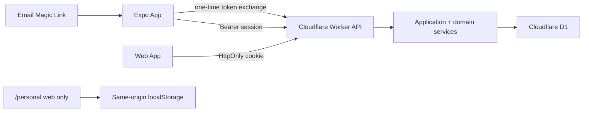

# Mobile Architecture

## Decision

DeepStudy uses Expo SDK 57, React Native, Expo Router, and strict TypeScript for
one iOS/Android client in `apps/mobile`. It is a native UI client, not a WebView
of the current website.

The Cloudflare Worker remains the only application backend. D1, authentication,
planning, focus timing, practice grading, mastery calculation, and ownership
checks stay server-side. This prevents the iOS, Android, and web clients from
developing different learning rules.

## Route map

| Native route | Purpose | Main API |
| --- | --- | --- |
| `/sign-in` | Register/sign in by email | `/api/auth/request-link` |
| `/auth/callback` | Exchange single-use mobile token | `/api/auth/mobile/exchange` |
| `/onboarding` | Any institution, semester, and course | `/api/onboarding` |
| `/(tabs)/today` | One current task, queue, focus timer | `/api/today`, `/api/focus-sessions` |
| `/(tabs)/courses` | Arbitrary user courses | `/api/courses` |
| `/(tabs)/practice` | Select or resume practice | `/api/practice` |
| `/practice-session/:id` | Hint-first attempt and reflection | practice session APIs |
| `/(tabs)/mastery` | Mastery bands and due reviews | `/api/mastery` |

## Authentication and token handling

- The email link carries only the existing 15-minute, one-time Magic Link
  token.
- `/api/auth/mobile/exchange` consumes it and returns the longer session through
  an HTTPS JSON response with `Cache-Control: no-store`.
- The session token is stored by Expo SecureStore with
  `AFTER_FIRST_UNLOCK_THIS_DEVICE_ONLY`.
- Every native API request uses an explicit `Authorization: Bearer` header.
- D1 stores token hashes, never raw Magic Link or session tokens.
- A replayed exchange fails.
- Server repository calls still require the current `userId`; hiding a button
  in the App is never treated as authorization.

The custom `deepstudy://` callback is a development foundation. Universal Links
and Android App Links are a release gate.

## Open-course invariant

Mobile onboarding accepts a private institution name, semester dates, a
required course name, and an optional course code. The mobile client never
branches on the original four subject identifiers. Questions created from the
App are private to the current account.

## Focus timing

The API owns `startedAt`. The App derives remaining time from
`startedAt + plannedMinutes`, rather than decrementing a trusted local counter.
Returning from lock screen or background therefore recalculates the correct
remaining time.

## Personal four-course boundary

The original `/personal` experience remains a protected, same-origin web route.
Its progress is browser `localStorage` and is intentionally not copied into the
native App, D1, public templates, or another user's account.

## Current scope

Implemented:

- native navigation and light/dark readable UI;
- secure Magic Link exchange and multi-device session model;
- open-course onboarding;
- Today/focus, Courses, Practice, and Mastery;
- client tests, Worker HTTP E2E, typecheck, lint, and Expo diagnostics.

Not yet implemented:

- native course/Assessment CRUD forms beyond onboarding;
- full English UI localization and an in-app language switcher;
- file/image/ICS upload;
- native AI tutor;
- billing and App Store/Play in-app purchase policy decision;
- push notifications and offline writes;
- production Universal/App Links;
- final icons, splash assets, accessibility device audit, and store submission.
