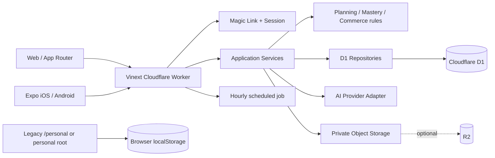

# DeepStudy Phase 0：当前状态审计

> 审计日期：2026-08-03（Australia/Sydney）
>
> 审计提交：`cdc4315`（`master`）
>
> 审计范围：当前工作树、公开 Workers 地址、Web/Worker、Expo 移动端、数据库迁移、测试与运维配置
>
> 本文性质：事实基线，不是实现提交；除 Phase 0 文档外不修改产品代码
>
> 后续状态：Phase 1 基础架构和 Phase 2 摄取管线已在此快照之后实施，见
> [phase-1-foundation.md](./phase-1-foundation.md) 与
> [phase-2-ingestion.md](./phase-2-ingestion.md)。本文保留为迁移前基线，不回写审计结论。

## 1. 结论

当前仓库已经不是最初的单页 Demo。它包含一个可分层的多用户学习 SaaS 基础、一个独立的旧四课程工作区，以及原生 Expo 移动端。认证、课程 CRUD、Assessment、今日计划、专注计时、练习、掌握度、AI 导师、私有资料、计费、提醒、后台和账户删除已经有实际代码与测试。

但是，目标中的 Adaptive Learning OS 六层核心尚未形成。当前系统的主要学习对象仍是 `topic + task + question`，资料处理仍是“上传后同步提取课程信息”，练习仍是一题一 Session 的通用流程。以下能力尚不存在：

- LMS Connector 协议与 Canvas 增量同步；
- 带版本、Hash、Chunk、Embedding 和定位引用的文档管线；
- Learning Objective、Concept、Prerequisite、Concept Graph；
- Pedagogy Router；
- 统一 Learning Pack 定义与可恢复状态机；
- Examiner、Coach、Reviewer、Tool Agent 等独立 AI Role；
- Tauri 桌面端与 Jupyter、VS Code、Terminal 等 Tool Adapter；
- 任何课程回答都必须返回可验证来源的引用契约。

因此不建议重写现有产品。建议保留现有应用层、纯领域规则、认证/隔离、移动端和适配器接口，通过兼容层逐步引入六层学习架构，并在新模块达到验收标准后替换旧流程。

## 2. 审计方法与基线

本轮检查了：

- `package.json`、TypeScript、Vite/Vinext、Cloudflare、Expo 和 Drizzle 配置；
- `app/` 下的页面、Route Handler 和旧四课工作区；
- `src/application`、`src/domain`、`src/repositories`、`src/services`；
- `db/schema.ts` 与 8 个有序迁移；
- `apps/mobile` 的路由、API Client、会话与 UI；
- 现有单元、集成、HTTP/E2E 与移动端测试；
- 公开地址 <https://uts-deep-study.dqq12125-study.workers.dev/> 的桌面/手机渲染和关键路由 HTTP 状态。

审计开始时 Git 工作树是干净的。代码规模基线如下；行数只统计 `.ts`、`.tsx`、`.mjs`，不包括依赖与构建产物。

| 区域 | 文件数 | 约行数 | 说明 |
| --- | ---: | ---: | --- |
| `app/` | 157 | 27,735 | Web 页面、API、旧四课内容与 UI |
| `src/` | 69 | 14,812 | 应用、领域、Repository、服务与基础设施 |
| `db/` | 2 | 1,238 | D1/Drizzle schema 与入口 |
| `worker/` | 1 | 156 | Worker fetch、图片与 Cron 入口 |
| `tests/` | 28 | 5,819 | Web/后端测试，不含移动端 tests |
| `apps/mobile/` | 46 | 9,429 | Expo iOS/Android 客户端与测试 |

### 2.1 本轮验证结果

| 检查 | 结果 |
| --- | --- |
| `npm run typecheck` | 通过 |
| `npm run lint` | 通过 |
| `npm run test:unit` | 32/32 通过 |
| `npm run test:integration` | 17/17 通过 |
| `npm run test:e2e` | 7/7 通过；包含 Web HTTP 与 Native bearer 流程 |
| `npm run build` | 通过；仍有单个/多个 client chunk 大于 500 kB 的警告 |
| Mobile typecheck | 通过 |
| Mobile lint | 通过 |
| Mobile tests | 8/8 通过 |

测试使用内存 D1-compatible SQLite、Mock Provider/Storage 等 Adapter；它们证明代码行为和隔离边界，不证明生产 D1、R2、邮件、AI、Stripe 或 App Store 配置已经完成。Node 对测试用 `node:sqlite` 会输出 experimental warning。

## 3. 当前技术栈

| 层 | 当前实现 | 判断 |
| --- | --- | --- |
| Web | React 19、Next 16 App Router API、Vinext 0.0.50、Vite 8 | 可继续使用；Web 目前仍位于仓库根目录 |
| Worker/API | Cloudflare Worker，App Router Route Handlers | 已有清晰 HTTP 边界，可作为迁移期兼容 BFF |
| Mobile | Expo 57、React Native 0.86、Expo Router、SecureStore | 可复用；不是 WebView |
| Desktop | 无 | 需要在 Tool Agent Phase 新建 Tauri 应用 |
| Database | Cloudflare D1 / SQLite、Drizzle schema、手写 Repository SQL | 现有业务可复用；不支持目标 pgvector/复杂检索 |
| Object storage | `PrivateObjectStorage`，有 R2、内存与 unavailable Adapter | 接口可复用；当前公开部署没有 R2 binding |
| Background work | Worker hourly Cron | 只覆盖提醒、重试邮件和删除清理；没有通用任务队列 |
| AI | OpenAI-compatible、mock、unavailable 三类 Provider | 有供应商隔离基础，但接口按当前功能硬编码 |
| Validation | Zod 4 用于多数 HTTP 输入；AI JSON 由手写解析器收敛 | HTTP 边界较好；AI 结构化输出未统一走 Zod Schema |
| Auth | 邮箱 Magic Link、Hash token、Web Cookie、Native Bearer exchange | 可保留并扩展 OAuth/学校连接授权 |
| Payments | Stripe Adapter、Webhook 幂等、server-owned entitlement | 属于可保留的外围能力 |
| Testing | Node test runner、内存 D1-compatible SQLite、HTTP 构建测试 | 基础较强；新六层需要契约、状态机和引用真实性测试 |
| Styling | Tailwind 4 引入、设计 token、大量手写全局 CSS | 视觉基础可保留，样式边界需要收敛 |

TypeScript 根项目启用 `strict: true`。根项目使用 TypeScript 5.9，移动端使用 TypeScript 6.0。当前不是完整 workspace monorepo：根 `package.json` 仍名为 `site-creator-vinext-starter`，没有 `workspaces`，根和 `apps/mobile` 各有一份 lockfile，Web/API 仍在根目录，也没有共享 package。

## 4. 当前运行架构



代码分层是当前最值得保留的资产之一：

- `app/`：页面与薄 HTTP Handler；
- `src/application/`：鉴权后的用例编排；
- `src/domain/`：纯 TypeScript 计划、掌握和 entitlement 规则；
- `src/repositories/`：带 `userId` 所有权条件的 D1 查询；
- `src/services/`：AI、支付、邮件、上传校验、存储与安全 Adapter；
- `src/infrastructure/`：Cloudflare Runtime Environment；
- `db/`、`drizzle/`：Schema 与前向迁移；
- `worker/`：Worker 与 Cron 入口。

这一分层允许替换数据库、AI Provider 和存储实现，而无需重写所有页面或学习规则。

## 5. 线上原型与仓库存在部署漂移

2026-08-03 的只读检查结果：

| 地址 | 结果 |
| --- | --- |
| `/` | 200；运行 `PERSONAL_DEPLOYMENT` 版本，显示旧“四课随身学”工作区 |
| `/pricing` | 200 |
| `/auth/sign-in` | 200 |
| `/app/today` | 500，Cloudflare Worker exception |
| `/app/courses` | 500，Cloudflare Worker exception |
| `/api/auth/session` | 500 |
| `/api/course-templates` | 500 |

配置解释了这一结果：

- `wrangler.jsonc` 没有 D1 或 R2 binding；
- `.openai/hosting.json` 声明 D1 binding `DB`，但 R2 为 `null`；
- `scripts/prepare-personal-deploy.mjs` 会主动移除 D1 和 Cron，并设置 `PERSONAL_DEPLOYMENT=true`；
- 个人部署模式让根路由显示旧四课 UI，但同一 Worker 中仍包含依赖 D1 的 SaaS 路由。

公开根响应还没有 CSP、HSTS、`X-Content-Type-Options`、Referrer-Policy、Permissions-Policy 和 COOP 等常用安全响应头。以上检查不是生产渗透测试，但足以说明：当前 URL 不能作为新 SaaS/API 的可用生产基线。

迁移时必须先建立带数据库、对象存储和环境变量的独立 preview，再决定是否切换现有公开 URL。旧个人工作区应继续受独立发布或 `/personal` 边界保护，不能与新多用户 API 共用“无数据库但路由仍公开”的运行模式。

## 6. 当前页面与用户界面

### 6.1 Web 路由

| 区域 | 路由 | 当前能力 |
| --- | --- | --- |
| 公共 | `/`、`/pricing` | 营销、价格与演示；个人部署时 `/` 改为旧四课应用 |
| 认证 | `/auth/sign-up`、`/auth/sign-in`、`/auth/verify`、`/auth/callback` | Passwordless Magic Link；forgot/reset 页面是说明性兼容页面 |
| 设置 | `/onboarding` | 任意学校、学期与课程的初始化 |
| 今日 | `/app/today` | 当前任务、原因、时间、完成标准、队列、课程、截止、复测提醒、专注计时 |
| 计划 | `/app/plan` | 周计划板、任务重排、重算与自定义任务 |
| 课程 | `/app/courses`、`/app/courses/:courseId` | 课程、课表、Assessment、Topic、任务、练习证据、资源管理 |
| 练习 | `/app/practice`、`/app/practice/:sessionId` | 选题、最多三层提示、作答、错误类型与反思 |
| 掌握 | `/app/mastery` | Topic 掌握区间、到期复测与历史证据摘要 |
| AI/资料 | `/app/tutor`、`/app/resources` | 独立 AI 聊天工作区和私有资料提取/确认 |
| 账户 | `/app/settings/profile`、`/study`、`/privacy`、`/billing` | 个人设置、通知/隐私、计费、导出/删除 |
| 其他 | `/app/notifications`、`/app/reports/weekly`、`/app/more` | 提醒、周报和次要入口 |
| 运维 | `/admin` | 管理指标、Flag、用户和题目审核 |
| 法律 | `/legal/privacy`、`/legal/terms`、`/legal/academic-integrity` | 占位法律内容，仍需正式审核 |
| 旧体验 | `/personal` | 受 owner allowlist 保护的四课程学习工作区 |

当前 Web 主导航是“今日、课程、计划、练习、更多”，并在所有宽度使用固定底部导航；桌面没有目标要求的左侧导航。“工具”和“进度”也不是一级导航，AI 导师位于顶部账户区，掌握度位于 More/独立路由。

Today 页面已经很好地保留了“现在做什么、为什么、多久、下一项、截止日期”的核心理念，但还存在目标差距：

- 首屏仍有 5 个概览指标，不是完全以一个主操作为中心；
- Risk 主要表现为到期复测提示，没有统一的截止、前置缺口和遗忘风险区；
- 当前任务是通用 `study_task`，还不是由 Learning Pack 生成的结构化 Session；
- 设备能力、专业工具和前置 Concept 不参与显示或排程。

课程详情目前偏 CRUD/管理：课表、Assessment、Topic、资源和历史证据已经齐全，但没有“教学周 → 模块 → 学习目标 → Concept Graph → 软件要求 → 推荐下一步”的课程脑视图。

### 6.2 关键 Web 组件

- Today：`FocusTimer`、`TaskActions`、`TodayQueue`、`RebalanceButton`；
- Plan：`PlanBoard`；
- Courses：课程创建/编辑、`AssessmentForm`、`ClassSessionManager`、`TopicManager`；
- Practice：`PracticeSetup`、`PracticeRunner`；
- Resources：`ResourcesWorkspace`；
- Tutor：`TutorWorkspace`；
- Legacy：`four-course-app.tsx`、题库、深度讲解、公式/坐标/作答工具和视觉组件。

旧四课应用包含有价值的学科内容与交互工具，但 `four-course-app.tsx` 约 3,609 行，课程、文案、路由状态、计划与 localStorage 交织。根 `globals.css` 约 5,400 行，`saas.css` 约 3,396 行且全局同时加载。迁移时应提取内容和可复用组件，不应把这个组件直接扩展成跨学科核心。

### 6.3 移动端

`apps/mobile` 是真正的 Expo/React Native App。已有：

- Magic Link 与 SecureStore 会话；
- Onboarding；
- Today、Plan、Courses、Practice、More tabs；
- Mastery 路由（当前从 tab 中隐藏）；
- 课程、Assessment、Class、Topic、Task、Question 的新增/编辑页面；
- Resources、Tutor、Notifications、Settings、Billing、Weekly Report；
- Practice Session 与课程/资源详情。

目标要求的手机主导航“今天、课程、练习、工具、进度”尚未落实。移动端 API 类型保存在自己的 411 行 `src/api/types.ts`，与服务端 Schema 手工同步，已有类型漂移风险。

### 6.4 桌面端

仓库没有 `apps/desktop`、Tauri 配置、Rust bridge 或本地 Tool Adapter。这部分为全新能力，不能用现有 Web PWA 声称已经完成。

## 7. 当前 API

`app/api` 有 66 个 Route 文件、85 个 HTTP Handler。主要分组如下。

| 分组 | 当前端点 |
| --- | --- |
| Auth/Account | `/api/auth/request-link`、`verify`、`session`、`sign-out`、`mobile/exchange`、`/api/account`、`/api/account/export` |
| Academic | `/api/onboarding`、`semesters`、`courses`、课程下 assessments/class-sessions/topics、单项编辑删除、`study-tasks` |
| Today/Plan | `/api/today`、`/api/plan`、`plan/rebalance`、`plan/reorder`、`focus-sessions` |
| Practice/Mastery | `/api/practice`、questions、sessions、hint、attempt、reflection、`/api/mastery` |
| AI | `/api/ai/tutor`、`/api/ai/practice`；另有旧个人工作区 `/api/tutor` |
| Resources | `/api/resources`、detail/delete、download、process、confirm |
| Settings/Reports | profile/study/notifications、notifications、weekly report |
| Commerce | entitlements、billing、checkout、portal、Stripe webhook |
| Admin/Ops | dashboard、feature flags、course templates、questions、users、scheduled job、analytics、Turnstile |

现有端点大多遵循“同源检查 → 鉴权 → Zod 输入 → Application Service → 统一错误”的模式，并通过 Repository 所有权条件避免跨用户读取。此模式可以直接用于新 API。

与目标 API 的主要差距：

- 没有 `/courses/:id/sync`、modules、concepts 或 Concept mastery；
- 资源 API 没有独立状态任务、版本、Chunk、增量处理或 reprocess 语义；
- 没有统一 `/learning-sessions` 与 step submission；
- 没有 `/daily-plan/generate` 和基于信号的 recalculate 契约；
- 没有 `/tools/*`；
- AI 回答没有统一返回 `sourceReferences`、`confidence`、`limitations`、`nextSuggestedAction`；
- 旧 `/api/tutor` 仍包含很长的专用 System Prompt，并在 personal deployment 下跳过用户鉴权，仅依赖同源检查和进程内限流。该端点必须继续隔离，不能成为新学习架构的基础。

## 8. 当前数据库与数据模型

当前 Schema 是 D1/SQLite，共 35 张表，迁移 `0000` 到 `0007` 均纳入版本控制。

### 8.1 Identity 与账户

- `users`
- `user_settings`
- `auth_sessions`
- `magic_link_tokens`
- `auth_rate_limits`

Token 以 Hash 保存，Web 使用 HttpOnly Cookie，Native 使用一次性 exchange 后的 bearer session。用户支持状态、角色、软删除和账户导出/删除。

### 8.2 Academic 与计划

- `institutions`
- `semesters`
- `user_semesters`
- `course_templates`
- `courses`
- `class_sessions`
- `assessments`
- `topics`
- `study_tasks`
- `focus_sessions`

`class_sessions` 和 `assessments` 已有 `source_uid` 与 `source_resource_id`，并对导入 UID 做幂等唯一约束。这只能避免已确认课表/Assessment 重复，不等于资源级 Hash 增量同步。

### 8.3 Practice 与 mastery

- `practice_questions`
- `practice_sessions`
- `practice_attempts`
- `mastery_records`

现有 attempt 记录正确性、分数、前后信心、提示数、错误次数、用时和错误类型。Mastery 是 Topic 级 0–100 分、信心分、复习间隔和连续正确/错误。它是透明规则系统，值得保留，但还不是目标的 Concept 级五档状态，也没有 hint dependency、explanation quality、transfer accuracy、delayed recall 等独立指标。

### 8.4 AI 与资源

- `ai_conversations`
- `ai_messages`
- `ai_usage_logs`
- `learning_resources`
- `resource_extractions`

AI usage 已记录模型、输入/输出 token、延迟、成功状态与估算成本，但没有 `courseId` 维度、缓存命中、prompt/schema 版本或每次引用。资源只保存对象元数据和一次 extraction proposal，没有 resource version、Hash、Chunk、parser version、embedding version 或 provenance graph。

### 8.5 Commerce 与 Operations

- `subscriptions`
- `purchases`
- `payment_webhook_events`
- `usage_events`
- `audit_logs`
- `feature_flags`
- `notification_preferences`
- `notifications`
- `notification_deliveries`
- `scheduled_job_runs`
- `support_access_grants`

这些外围模块与目标学习架构不冲突，应继续保留。当前不是每张主表都统一具有 tenant、source metadata、`deleted_at`/状态；新 Schema 必须把这些字段作为明确约定，而不是继续逐表临时添加。

## 9. 当前资料处理能力

当前流程是：

```text
浏览器/手机上传
→ MIME、扩展名、文件头、大小校验
→ R2/内存 Adapter 保存
→ 同一 HTTP 用例内处理
→ PDF/Text/ICS/图片提取
→ 本地规则 + AI 提取课程、Assessment、Class、Topic
→ 用户确认
→ 写入现有 Academic 表
```

已支持：PDF、JPEG、PNG、WebP、TXT/Markdown、ICS；文件上限 10 MB，PDF 上限 250 页。PDF 使用 `unpdf`，ICS 有本地解析器，图片交给支持 vision 的 AI Provider。

缺口：

- 不支持 PPT/PPTX、Word、Excel、HTML、音视频字幕、Notebook、源代码或专业项目文件；
- 处理发生在请求链中，没有 Queue、Lease、Retry policy 或 dead-letter；
- 没有 Hash 去重、资源版本和变化 Chunk 重处理；
- 没有页/幻灯片/段落级 Chunk 表；
- 没有 Embedding 或向量检索；
- AI Tutor 只是把用户选中的资源提取文本截断后放入上下文；
- 没有可靠页码引用，因此无法满足“任何课程回答必须可追溯”的验收标准；
- 没有 Connector 抽象、Mock LMS 或 Canvas 实现。

## 10. 当前 AI、计划与掌握逻辑

### 10.1 AI

`AiProvider` 当前提供 `tutor`、`extractCourseData`、`generatePractice`、`classifyError`。Runtime 可选 OpenAI-compatible、Mock 或 Unavailable Provider，并支持 Tutor/Extraction 两个模型 key 和调用成本日志。

可复用部分：Provider Adapter、Mock、usage logging、学术诚信风险检查、untrusted context 包装、应用层额度与 entitlement。

需要升级部分：

- 改为通用 `generateStructured`、`generateText`、`embed`、可选 `transcribe`；
- 业务代码通过 task policy 选择模型能力等级，而不是知道 provider/model；
- 所有结构化输出使用版本化 Zod Schema；
- Prompt 从 Provider 实现中分离并带版本；
- 新回答强制引用契约与“找不到可靠资料”的失败语义；
- 五种 AI Role 应由状态机/权限决定，不靠一个长 Prompt 模拟全部行为。

### 10.2 Planner

已有纯函数处理截止紧迫度、Assessment 权重、低掌握风险、临近课程、用户优先级和长任务惩罚，也支持每日容量与重排。实际 `generateDailyPlan` 当前只把 Assessment 和每门课程的通用 review 任务作为候选，没有传入前置缺口、遗忘风险、老师信号、设备或工具可用性，也没有把任务拆成 Learning Session steps。

### 10.3 Mastery

已有规则会区分独立正确、使用提示、首次错误、过早重复、延迟复测、难度与用时，并生成下一次复习时间。该规则比“看过/完成”更可信，应作为新 Mastery Engine 的初始证据计算基础。

目标差距在于当前粒度是 `topic`，一次 Practice Session 只有一题，提示最多三次且无目标中的五级语义；没有独立解释、迁移任务、专业工具操作或 48 小时复测的分项指标。现有 0–100 分也需要映射成可解释的五档状态，而不是继续在 UI 强调精确分数。

## 11. 目标能力 Gap Analysis

| 目标层/能力 | 当前状态 | Gap | 优先级 |
| --- | --- | --- | --- |
| Course Data Ingestion | 私有手动上传，PDF/Text/Image/ICS | 无 Connector、Canvas、Hash、版本、Queue、广格式解析 | P0 |
| Course Brain | Course、Topic、Assessment、Resource | 无 Objective、Concept、Edge、Prerequisite、Tool requirement、引用检索 | P0 |
| Pedagogy Router | 无 | 规则/AI 二层路由、Schema、置信度与决策日志全部缺失 | P0 |
| Learning Pack Engine | 单题 Practice + Focus Session | 无 Pack Registry、统一 Session/Step、状态机、恢复与版本 | P0 |
| Tool Agent Layer | 无 | Desktop、Adapter、审批、执行、验证、回滚全部缺失 | P1（Phase 6） |
| Mastery Engine | Topic 级透明规则 | 需要 Concept 粒度、五档、分项证据、迁移/延迟/工具能力 | P0/P1 |
| Daily Planner | Deadline/weight/capacity 基础 | 缺前置、遗忘、教师、设备、工具与 Session 结构 | P1 |
| 引用与 RAG | 选定资源全文截断 | 无 Chunk、Embedding、引用真实性和拒答规则 | P0 |
| AI Roles | Tutor 与练习生成 | Examiner/Coach/Reviewer/Tool Agent 缺失 | P1 |
| Web | 已实现 | 需改五项导航、桌面左栏、动态学习工作区 | P1 |
| Mobile | 原生核心流程已实现 | 需共享类型、五项导航、Quick Pack 与跨设备 Session | P1 |
| Desktop | 无 | Tauri 与 local bridge 为新建 | P1 |
| 安全/诚信 | 鉴权、隔离、Hint-first、审计基础 | 缺工具审批 token、连接令牌加密、引用防伪；个人部署边界需修复 | P0 |
| 成本 | Token/latency/cost 日志 | 缺课程维度、Embedding、缓存、批处理和模型路由指标 | P1 |

## 12. 可复用、需重构与新建

### 12.1 直接保留并扩展

- Magic Link、Session、Native exchange 与账户删除；
- Repository 中的 `userId` 所有权查询模式和双用户隔离测试；
- Application/Domain/Repository/Adapter 分层；
- Planner 与 Mastery 的纯函数及其测试；
- `PrivateObjectStorage`、AI/Stripe/Email Adapter 模式；
- Zod HTTP 输入校验、统一 API Error 与 request ID；
- Expo App、SecureStore、服务器权威专注计时；
- 通知、周报、Feature Flag、Admin、Entitlement 与审计能力；
- 旧四课中的原创题、Rubric、数学/物理/C/电路交互工具和教学内容，作为版本化模板资产迁移。

### 12.2 保留行为但重构边界

- `topics`：拆分/映射到 Module、Learning Objective 和 Concept；
- `practice_sessions`：迁入统一 Learning Session 状态机；
- `mastery_records`：映射为 Concept Mastery + Evidence；
- `study_tasks`：成为 Daily Plan Item/Session request，而不是最终学习体验；
- AI Provider：保留 Adapter，替换为通用结构化接口和模型策略；
- 资源服务：保留隐私/上传校验，改为版本化异步管线；
- Web/Native API DTO：移入共享 package；
- CSS 和 Legacy 工作区：提取 token/组件/内容，不直接继续堆叠。

### 12.3 全新模块

- Connector、sync run、resource version/chunk/embedding；
- Course Brain 与 Concept Graph；
- Pedagogy Router；
- Learning Pack Registry、Step Engine、Session event/state；
- Tool Agent 协议与 Tauri local bridge；
- 引用验证器与来源感知 AI Response；
- 通用 Background Job Adapter；
- PostgreSQL/pgvector 目标 Schema 与受控迁移工具。

## 13. 当前风险

1. **公开部署不可作为 SaaS 基线。** 旧个人应用可见，但新 app/API 因缺 D1 报 500。
2. **个人部署 AI 边界。** `/api/tutor` 在 personal mode 下无用户鉴权且使用进程内限流，应与新产品部署彻底隔离。
3. **无可靠引用。** 当前 AI 可以使用资料文本，但无法证明答案来自哪一页；这是第一版验收的硬阻塞。
4. **D1 与目标检索不匹配。** D1 代码已有价值，但目标需要 pgvector、复杂关联和可扩展任务处理；必须通过 Repository seam 迁移，不能原地大改全部 SQL。
5. **类型重复。** Web Schema、服务 DTO 和移动端 types 手工同步，新增 Session/Pack 后会快速漂移。
6. **同步请求处理文件。** 大 PDF 或 AI 延迟会占用请求，重试、幂等和部分失败不可观察。
7. **学习抽象过窄。** 当前一题练习无法承载编程、写作、语言、设计或仿真工作区。
8. **全局 UI 边界大。** Legacy 与 SaaS CSS 同时进入根布局，桌面导航也不符合目标信息架构。
9. **旧文档存在时点差异。** `docs/CODEBASE_AUDIT.md` 描述的是商业化改造前状态；部分移动端文档也落后于当前新增页面。后续应以本文为 Phase 0 基线。

## 14. Phase 0 完成定义

Phase 0 只产出审计与迁移设计，不迁移目录、不修改数据库、不实现新功能。后续开始 Phase 1 前必须满足：

- 团队确认 `docs/target-architecture.md` 的目标边界；
- 确认 PostgreSQL/pgvector 是目标系统记录库，D1 仅作为迁移期兼容；
- 建立可用的 preview 环境，不直接覆盖当前个人部署；
- 固化现有 Web、API、Mobile 与双用户隔离测试作为回归门禁；
- 将第一批改动限制在 workspace、共享 contract 和兼容 Adapter，不先移动所有页面。
