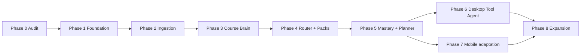

# DeepStudy / Adaptive Learning OS：迁移计划

> 状态：Phase 2 已实施；Phase 3 尚未开始
>
> 日期：2026-08-03
>
> 原则：一次只实施一个 Phase；每个 Phase 以可运行、可回滚、通过门禁的增量结束

## 1. 迁移目标

在不删除当前可用功能的前提下，把现有 `topic + task + practice` 学习 SaaS 演进为六层 Adaptive Learning OS：

1. Course Data Ingestion；
2. Course Brain；
3. Pedagogy Router；
4. Learning Pack Engine；
5. Tool Agent Layer；
6. Mastery and Planning Engine。

迁移采用 Strangler Pattern：新领域能力放入独立 package，当前 Web Route Handler 和移动端继续通过兼容 API 工作；只有当新模块具有数据迁移、回归测试、观测和回滚路径后，旧实现才停止接收新写入。

## 2. 不可破坏的现有行为

以下能力在迁移期间必须持续通过自动化测试：

- Magic Link 登录、Web Cookie、Native bearer exchange 与退出；
- 用户 A 不能读取或修改用户 B 的课程、资料、AI、练习、掌握、计费和通知；
- 任意大学/课程的 Onboarding 与课程 CRUD；
- Today 当前任务、计划、Assessment、专注计时与跨后台时间重算；
- Hint-first 练习、错误记录、掌握更新和延迟复测；
- 资料上传、用户确认、下载/删除与账户全量删除；
- AI Provider 不可用时安全失败，token/cost 日志不泄露密钥；
- Stripe webhook 幂等、entitlement、通知与 Admin role；
- Expo 当前核心页面和上一版本 API 合约；
- `/personal` 的旧四课体验和已有 localStorage，不被新多用户数据自动覆盖。

所有新端点和 Schema 默认 additive。删除列、重命名表、改变状态语义或撤下旧 API 必须在后续独立 cleanup release 中完成，不能与功能切换同一提交。

## 3. 迁移顺序与依赖



依赖顺序不可颠倒：没有版本化 Resource/Chunk 就不能承诺引用；没有 Course Brain 就不能可靠路由；没有 Pack 状态机就不能产生完整 mastery evidence；没有审批状态机就不能执行 Tool Action。

## 4. Phase 0：审计与设计（本次）

### 4.1 输出

- `docs/current-state.md`：当前代码、页面、API、数据库、部署和 Gap Analysis；
- `docs/target-architecture.md`：六层目标、数据/AI/API/UI/安全架构；
- `docs/migration-plan.md`：按 Phase 的迁移、数据映射、门禁和第一批文件。

### 4.2 明确不做

- 不移动 `app/`、`src/`、`db/`；
- 不改 D1 Schema 或迁移；
- 不创建空壳 Connector/Pack/Tool Adapter；
- 不重新设计页面；
- 不部署或覆盖公开 Worker；
- 不安装新运行时依赖。

### 4.3 完成门禁

- 当前状态、目标与迁移文档相互一致；
- 文档明确已完成能力和真实缺口；
- 现有 typecheck、lint、unit、integration、build 基线可复现；
- Git diff 只包含 Phase 0 文档及旧迁移文档的受控更新/改名。

## 5. Phase 1：基础架构

> 实施结果（2026-08-03）：Slice 1A–1D 的代码边界已经落地，现有 Web
> 仍在根目录、D1 仍是运行时权威数据源。真实 preview PostgreSQL shadow
> read 需要项目方提供环境后执行，不视为已经完成生产切换。详细门禁和
> 限制见 [phase-1-foundation.md](./phase-1-foundation.md)。

Phase 1 不新增最终用户学习模式，目标是建立后续模块不会重复造类型、数据库和 Provider 边界的基础。

### 5.1 Slice 1A：Workspace 与共享 Contract

1. 根项目加入 npm workspaces，保留现有 npm/lockfile 流程；
2. 建立 `shared-types`，集中 ID、SourceReference、LearningMode、AI Role、API response 和 Zod schema；
3. 建立 `api-client`，让 Web/Mobile/Desktop 使用相同 response/error 解析；
4. 移动端 `src/api/types.ts` 改为兼容 re-export，不一次重写 30 个页面；
5. 为当前 API 建 contract tests，锁定上一版本移动端兼容性；
6. 根 Web 仍在原位，不在这一 Slice 移动到 `apps/web`。

### 5.2 Slice 1B：AI、Storage 与 Job 抽象

1. 建立通用 `AIProvider.generateStructured/generateText/embed/transcribe?`；
2. 建立 model policy，将 low/medium/high capability 与供应商模型名隔离；
3. 所有结构化 AI 输出改为 Zod；
4. Prompt 迁入版本化 registry；
5. 保留当前 `tutor/extract/generatePractice/classifyError` 作为兼容 facade；
6. 把现有 `PrivateObjectStorage` 迁入 package，不改变 R2 行为；
7. 新建 Job Queue 接口、inline test adapter 和 retry/idempotency contract，但不把旧上传立即异步化。

### 5.3 Slice 1C：PostgreSQL/pgvector Schema 与迁移工具

1. 用 PostgreSQL dialect 建立目标表族和版本迁移；
2. 明确 owner/source/status/timestamps 的统一列约定；
3. 建立 D1 export、PostgreSQL import、ID mapping、row count/checksum 脚本；
4. 为 Repository 建 storage contract tests；
5. 在 preview 对相同 fixture 执行 D1/PostgreSQL shadow read；
6. 不在同一 Slice 切换所有写入；认证和现有核心流先保持 D1 权威，直到迁移演练通过。

鉴于当前公开 SaaS 路由不可用且看不到可用生产 D1，本项目优先采用“一次性受控 cutover + D1 只读快照”，避免长期双写。如果上线前发现已有真实多用户数据，再增加 outbox 同步阶段，不能使用无事务保证的直接双写。

### 5.4 Slice 1D：Auth/API/Design System 基线

1. 复用当前 Magic Link，不重做认证；增加 OAuth/Connector token 的加密接口和 key rotation contract；
2. 当前 Route Handler 继续做兼容入口，把共享 use case 暴露给未来 `apps/api`；
3. 建立设计 token、Web 基础组件和 React Native token adapter；
4. 新增桌面左栏/移动底栏的导航 shell 组件，但不切换业务页面；
5. 统一安全响应头与 production config validation。

### 5.5 Phase 1 验收

- Workspace 安装、根 Web、Expo 都可独立构建；
- Web/Native 使用同一 contract package；
- AI structured response 必须通过 Zod，Provider 可替换；
- PostgreSQL migrations 可从空库重复执行，pgvector 可用；
- D1 fixture 可导入 PostgreSQL，计数和 ID/所有权校验一致；
- 现有全部功能和上一版 Native API 继续通过；
- 没有把现有公开 URL 直接切到未完成的新后端。

## 6. Phase 2：课程导入

实施结果（2026-08-03）：本节已按兼容策略完成，详见
[phase-2-ingestion.md](./phase-2-ingestion.md)。D1 runtime 采用 persistent inline
job 作为迁移实现，真实队列出队、Canvas OAuth UI 与旧 `.ppt` 转换列为已知部署/
格式门，不提前进入 Phase 3 补做。

### 6.1 实现顺序

1. Connector registry 与 contract suite；
2. Mock Connector；
3. Manual Upload Connector；
4. Canvas Connector 基础授权、课程/模块/作业/日历/资源读取；
5. `resources`、`resource_versions`、`processing_jobs`；
6. Hash、去重、tombstone、增量同步日志；
7. PDF、PPT/PPTX、文本与作业文档解析；
8. page/slide/section locator 与 Chunk；
9. Embedding 和质量检查；
10. 资源状态 UI。

Canvas 优先官方 API。浏览器扩展只在 API 不足且获得明确权限时开始；不保存学校密码，不自动提交作业或参加 Quiz。

### 6.2 兼容策略

- 当前 `/api/resources` 保留，内部改用 Manual Upload Connector；
- 旧 `learning_resources/resource_extractions` 通过 Adapter 映射到新 resource/version/job；
- 旧同步上传在 Feature Flag 后继续可用，直到异步状态页稳定；
- 当前确认 Assessment/Class/Topic 的交互保留，但写入 provenance。

### 6.3 验收

- 同一文件重复上传不创建重复 active version；
- 文件变化只解析/Embedding 变化 Chunk；
- 删除源先 tombstone，不立即物理删除；
- 每个 Chunk 有可验证页/slide/section；
- Job 可重试且不重复写入；
- Mock、Manual、Canvas 通过同一 Connector contract tests。

## 7. Phase 3：Course Brain

### 7.1 实现

- Teaching Week、Module、Learning Objective、Concept、Skill；
- Concept Edge/Prerequisite；
- Resource/Assessment/Rubric/Tool requirement 关系；
- AI 提取 + Zod + evidence reference + confidence/review status；
- hybrid retrieval 与 Citation Resolver；
- Course Brain API；
- 课程页的结构视图和“推荐下一步”。

### 7.2 迁移

现有 `topics` 不直接改名。每个 Topic 先创建一个 provisional Concept，并保留 `legacy_topic_id`；人工/AI 分解成多个 Concept 后使用显式 supersede/merge relation。旧练习仍通过 mapping 找到目标 Concept。

### 7.3 验收

- 能回答“Assessment 考哪些 Concept、前置是什么、资料在哪里解释”；
- 每个关系可回到 evidence reference；
- 越权、已删除、旧版本引用被拒绝；
- 无可靠资料时 API 明确说明，不生成虚假引用；
- Course 页面不影响现有课表、Assessment 和资源 CRUD。

## 8. Phase 4：Pedagogy Router 与首批 Learning Packs

### 8.1 Router

- 规则引擎先执行；
- AI 只处理冲突/低置信度；
- Zod 输出、fallback、版本和 decision log；
- 可解释 reasons、required tools 和 session plan。

### 8.2 Pack 实现顺序

1. `memory_retrieval`：最接近现有 Practice，先完成兼容迁移；
2. `concept_understanding`；
3. `quantitative_problem_solving`；
4. `programming_computation`；
5. `reading_argumentation`。

每个 Pack 必须同时交付 Definition、状态机、Web UI、API、fixture、mastery signals、completion rules、integrity tests 和恢复测试。不能先建五个空枚举再称完成。

### 8.3 兼容策略

- 当前 `practice_sessions` 作为 `legacy_practice` 历史保存；
- `/api/practice/*` 保持到 Mobile 切换完成；
- 新 `/learning-sessions` 先由 Web 使用，移动端继续旧 API；
- 旧 AI Tutor 仍可独立使用，但不驱动 Session 状态。

### 8.4 验收

- Router 对典型目标输出预期 mode 与原因；
- 低置信度/Provider 故障走确定性 fallback；
- Session 可暂停、刷新、换设备恢复；
- 不能跳步或重复提交副作用；
- Quantitative 提示遵守 1–5 级；
- Programming 修改后强制解释错误、修改原因和边界；
- Reading 不默认生成完整可提交论文；
- 所有课程资料内容带真实引用。

## 9. Phase 5：Mastery 与 Daily Planner

### 9.1 Mastery

- Concept 级五档状态；
- mastery evidence 事实表；
- independent accuracy、hint dependency、explanation、transfer、delayed recall；
- error pattern 聚合；
- review schedule；
- 规则版本、before/after 与重算工具。

### 9.2 Planner

- 按 0–1 normalized signal 和固定权重计算；
- 纳入 deadline、weight、prerequisite gap、forgetting、teacher、preference；
- 纳入可用时间、设备和工具；
- 输出具体 Pack Session 和步骤时间；
- 计划变更保存原因与旧版本，可撤回当天手工调整。

### 9.3 Today UI

首页重组为 Now、Today、Classes、Upcoming、Risk；一个主要“开始学习”操作。桌面切左侧五项导航，手机切底部五项导航。统计移到进度页面，首页只保留决策所需信息。

### 9.4 验收

- 完整 Session 自动写 mastery evidence 并更新 Concept；
- 使用提示、早期重复和延迟迁移的结果不同且可解释；
- Planner 同输入/版本输出确定；
- 手机不安排必须用 MATLAB 的立即 Session；
- Today 明确显示为何是当前项、多久、下一项和风险；
- 旧 mastery 数据可见但标记为 legacy/低可信，不被提升为 transfer-ready。

## 10. Phase 6：桌面 Tool Agent

### 10.1 实现

- `apps/desktop` Tauri shell；
- 本地 bridge/device identity；
- File System Read-only、Jupyter、VS Code、Terminal Sandbox Adapter；
- Observe/Explain/Propose/Approve/Execute/Verify/Record；
- action hash、短时一次性 approval token；
- Tool Run、Action、Approval、Verification、Rollback 数据；
- 工作区路径、进程、输出和取消限制。

### 10.2 验收

- 无批准不能产生写操作；
- 批准内容被修改后执行必须拒绝；
- 执行前后 Snapshot 和验证结果可审计；
- 支持的动作有 rollback 或明确标记不可回滚；
- Jupyter/Terminal 故障不破坏 Learning Session，可恢复或改为手工步骤；
- 学生必须先预测，才能运行仿真/实验步骤。

## 11. Phase 7：移动端

现有 Expo App 不重建。迁移内容：

- 使用 shared types/api client；
- 一级导航改为 Today、Courses、Practice、Tools、Progress；
- Quick Practice、音频、提醒、进度；
- Learning Session 跨设备恢复；
- 手机显示 Tool Session 状态，但不执行复杂桌面 Adapter；
- 离线只保存安全的草稿/队列，Mastery 仍由服务器确认；
- Universal/App Links、push 和 real-device accessibility 验收。

移动端不负责 LMS 全量扫描、专业软件控制或复杂课程脑编辑。

## 12. Phase 8：扩展

依次加入：language communication、design project、simulation experiment、case reasoning；再加入 MATLAB、LTspice、Excel、Simulink。每个新 Pack/Adapter 必须复用相同 contract tests，不能创建旁路状态或审批逻辑。

## 13. 数据迁移映射

| 当前数据 | 目标 | 迁移规则 |
| --- | --- | --- |
| `users`、settings、auth | 对应 Identity 表 | 保留 ID/Hash/状态；敏感 token 不导出明文 |
| `institutions`、semesters、courses | 对应目标表 | 保留 owner 和 source type；补 tenant/source metadata |
| `class_sessions`、`assessments` | 同名/目标 Academic 表 | 保留 `source_uid/resource_id` 幂等信息 |
| `topics` | provisional `concepts` + mapping | 不自动拆解；标记 legacy provenance |
| `study_tasks` | legacy task + `daily_plan_items` | 历史任务保留；新计划只写新表 |
| `focus_sessions` | Session activity/evidence | 保留开始/结束/完成状态，不凭时间提升 mastery |
| `practice_questions` | Pack activity/question assets | 保留 owner/review/source；公共题继续审核 |
| `practice_sessions/attempts` | legacy learning sessions + attempts/evidence | 保留 hints/time/error；Pack version 标为 legacy |
| `mastery_records` | initial `concept_mastery` | 只作为低/中可信基线；不得自动成为 transfer-ready |
| `learning_resources` | `resources/resource_versions` | 对象 key 保留；计算 Hash；旧 extraction 成 version provenance |
| `resource_extractions` | processing job/output | 原 proposal 保留为 legacy processor output |
| `ai_conversations/messages` | AI interactions/history | 无引用的旧消息不补造引用 |
| `ai_usage_logs` | 新 usage/cost | 保留历史；新增 course/task/schema/cache 字段 |
| commerce/notifications/admin | 对应外围表 | 语义不变，优先原样迁移 |
| `/personal` localStorage | 不自动迁移 | 可选显式 owner import；只作草稿/弱历史证据 |

### 13.1 Cutover 步骤

1. 备份 D1 与 R2 object inventory；
2. 在 preview 空 PostgreSQL 应用全部 migration；
3. 导出 D1，校验行数、外键和 owner；
4. 幂等导入并生成 ID mapping/report；
5. 对 fixture 和真实抽样做 D1/PostgreSQL shadow read；
6. 在维护窗口停止旧写入；
7. 执行最终 delta import；
8. 切换 read/write Feature Flag；
9. 运行登录、两用户隔离、课程、Today、Practice、删除烟雾测试；
10. D1 保持只读快照至少一个回滚窗口；
11. 稳定后才单独计划旧 Schema/Adapter 清理。

## 14. API 兼容与废弃策略

- 新 contract 添加字段时保持旧客户端可忽略；
- 状态枚举变化必须在服务端做映射，不能让旧 Native 崩溃；
- 当前 `/api/practice/*`、`/api/today`、`/api/resources` 至少支持上一版 Native；
- 新 Learning Session 可先使用 `/api/v1/learning-sessions`；
- 废弃端点先记录调用、返回 deprecation metadata、等待活跃客户端低于门槛，再单独删除；
- 旧 `/api/tutor` 只属于 personal workspace，不进入公共 SDK；
- Web、Mobile、Desktop 的生成类型来自同一 Zod contract，不手写三份 DTO。

## 15. 发布与回滚

### 15.1 环境

至少分为：local、test、preview、production、personal。`personal` 不包含公共 SaaS/API 路由；preview 必须配置独立数据库、对象存储、队列和非生产 Provider。

### 15.2 Feature Flags

按 connector、async ingestion、course brain read、router、各 Pack、new mastery、new planner、tool agents 分开。Schema 可以先部署，功能默认关闭；不能用一个总开关同时切换所有核心层。

### 15.3 回滚

- 应用：保留上一兼容 Worker/Web build；
- 数据库：前向补偿 migration，不 destructive down migration；
- 数据切换：在回滚窗口内把 read flag 切回 D1 只读/旧流程，写入恢复需先检查 delta；
- Resource：新 active version 失败时恢复上一 active version；
- Router/Pack：按 version 固定已开始 Session，不让发布中途改变流程；
- Tool：记录 rollback capability，不能回滚的动作在批准前明确提示；
- Native：后端至少兼容上一发布版本，不要求强制同时升级。

## 16. 每个 Phase 的统一质量门禁

每次实现提交结束前运行：

```powershell
npm run typecheck
npm run lint
npm run test:unit
npm run test:integration
npm run test:e2e       # 涉及路由/用户流时
npm run build

npm run typecheck --prefix apps/mobile
npm run lint --prefix apps/mobile
npm test --prefix apps/mobile
```

新增 workspace 后改为根 orchestration script，但门禁含义不变。数据库变更还必须运行 migration-from-empty、migration-from-previous、两用户隔离和 backfill checksum；文档处理要跑 golden/citation tests；Tool Agent 要跑 approval/verification tests。

任何失败都必须修复或在当前 Phase 明确标记为阻塞，不能把失败留给下一 Phase。

## 17. 第一批需要创建或修改的文件

以下是 **Phase 1 Slice 1A 的第一批**，不是本次 Phase 0 要立即创建的文件。范围刻意限制为 workspace 与共享 contract，不移动页面、不改数据库。

### 17.1 创建

```text
tsconfig.base.json

packages/shared-types/package.json
packages/shared-types/tsconfig.json
packages/shared-types/src/index.ts
packages/shared-types/src/ids.ts
packages/shared-types/src/source-reference.ts
packages/shared-types/src/course.ts
packages/shared-types/src/learning.ts
packages/shared-types/src/ai.ts
packages/shared-types/src/api.ts

packages/api-client/package.json
packages/api-client/tsconfig.json
packages/api-client/src/index.ts
packages/api-client/src/client.ts

packages/ai/package.json
packages/ai/tsconfig.json
packages/ai/src/provider.ts
packages/ai/src/model-policy.ts
packages/ai/src/schemas.ts

packages/testkit/package.json
packages/testkit/src/contract-fixtures.ts
tests/shared-contracts.test.mjs
```

### 17.2 修改

```text
package.json                       # 改项目名、增加 workspaces 与统一 scripts
package-lock.json                  # 由 npm install 机械更新
tsconfig.json                      # extends base，保留现有 path compatibility
eslint.config.mjs                  # 覆盖 packages，仍排除构建产物

apps/mobile/package.json           # workspace dependency
apps/mobile/tsconfig.json          # shared types path/project boundary
apps/mobile/src/api/types.ts       # 兼容 re-export，逐步删除重复 DTO
apps/mobile/src/api/client.ts      # 使用共享 error/response contract

src/services/ai/types.ts           # 兼容 facade 到新 AI contract
src/services/ai/mock-ai-provider.ts
src/services/ai/unavailable-ai-provider.ts
src/services/ai/openai-compatible-provider.ts
src/application/runtime.ts         # 从统一 Provider factory 组装
src/lib/schemas.ts                 # 从 shared-types 导入公共 Zod schema

README.md                          # 新 workspace 命令与迁移期目录说明
docs/ARCHITECTURE.md               # 指向目标架构并说明当前兼容边界
docs/TESTING.md                    # workspace/contract tests
```

### 17.3 第一批明确不修改

- 不移动 `app/` 到 `apps/web`；
- 不移动所有 `src/domain`；
- 不修改 `db/schema.ts` 或现有 D1 migration；
- 不删除移动端本地 types，先 re-export；
- 不改变公开路由、数据库 binding 或部署域名；
- 不实现 Connector、Course Brain、Pack 或 Tool Adapter 空壳；
- 不进行视觉重设计。

这样可以把第一批 diff 控制在“建立共享边界”，出现问题时只需恢复 import/facade，不影响现有数据。

## 18. Phase 1 开始前的决策门

开始下一 Phase 前需要项目所有者确认以下架构选择；这些选择不影响本次 Phase 0 文档完成：

1. PostgreSQL 托管平台和连接方式，但业务代码只依赖标准 PostgreSQL/pgvector；
2. Cloudflare Queues 或 PostgreSQL-backed queue 作为首个 Job Adapter；
3. 新 SaaS preview 的域名、D1/R2/PostgreSQL 数据处理区域；
4. 现有 Workers URL 是继续作为 personal deployment，还是在新系统稳定后切换；
5. 生产 AI 数据保留政策和允许的 Provider；
6. Canvas 首个授权方式与学校 API 可用性；
7. 是否存在需要从 D1 迁移的真实多用户数据。若没有，使用一次性 cutover；若有，增加 outbox/delta 阶段。

## 19. 已知限制

- 本计划没有承诺具体发布日期或应用商店审核时间；
- 浏览器扩展和学校 API 能力受各机构政策影响；
- PPT/Office、音视频和专业项目解析器需要按真实样本建立 golden tests；
- PostgreSQL/pgvector 选择解决检索存储，不自动解决 Concept 抽取质量；
- Tool Agent 的可执行能力取决于各软件官方 API/CLI，视觉点击只作为最后手段；
- 当前公开部署的 500 需要独立环境配置修复，不能靠文档或前端改版解决。
