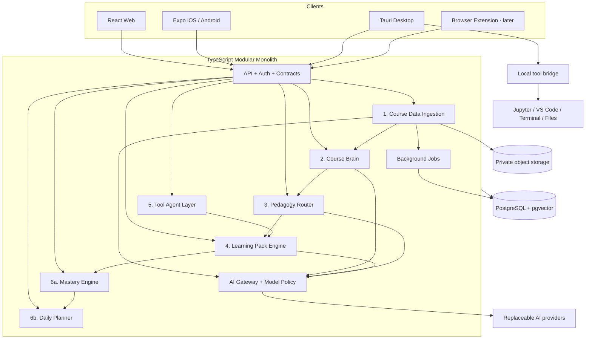
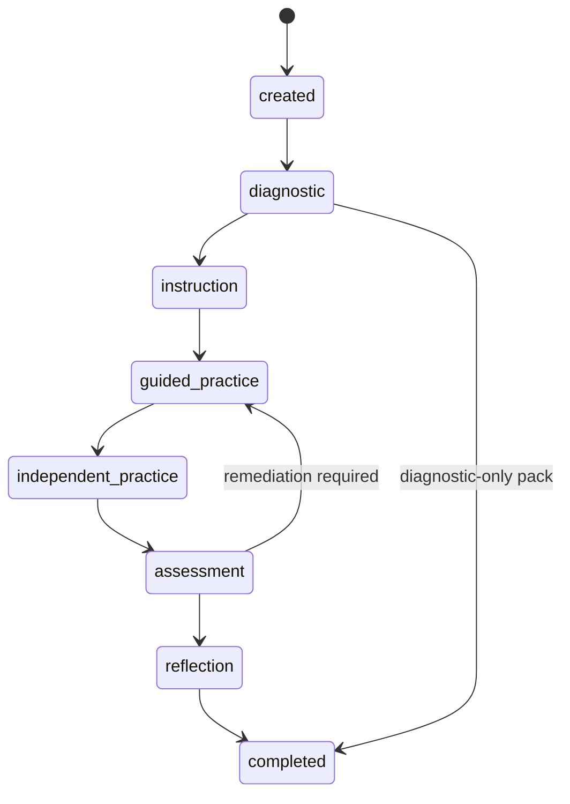

# DeepStudy / Adaptive Learning OS：目标架构

> 状态：Phase 0 目标设计；Phase 1–2 已建立基础与摄取实现
>
> 日期：2026-08-03
>
> 约束：演进现有代码，不以重写换架构；工作流由代码和状态机控制，AI 是受约束的能力提供者

## 1. 架构决策摘要

1. **采用模块化单体，不先拆微服务。** Web、API、Job Worker 可以独立构建，但共享一个版本化领域层和一个主数据库。
2. **采用 npm workspaces 逐步形成 TypeScript monorepo。** 保留现有 npm 工具链，先提取 package，再移动根 Web，避免一次性路径重写。
3. **目标主数据库为 PostgreSQL + pgvector。** 现有 D1 通过 Repository 接口保留为迁移期兼容源；切换前不删除 D1 数据或迁移历史。
4. **对象存储使用 Adapter。** 现有 R2 实现继续可用，同时保持 S3-compatible 可替换性。
5. **后台任务使用统一 Job Queue 接口。** 文档处理、Embedding、同步和通知不得绑定某个队列产品；首个实现可部署到 Cloudflare Queues 或 PostgreSQL-backed worker。
6. **API 是所有客户端的权威业务边界。** Web、Expo 和 Tauri 不各自实现规划、掌握或路由规则。
7. **Learning Session 是状态机，不是聊天记录。** 每次状态转换、提示、作答、评分和恢复都由服务端验证并持久化。
8. **AI 输出默认结构化。** 所有结构化结果经过版本化 Zod Schema；模型选择由任务策略决定，业务模块不直接引用供应商模型名。
9. **课程资料回答必须引用。** 无可验证来源时明确返回限制，不允许合成不存在的文件、页码或 Chunk。
10. **工具写操作必须显式批准。** Observe/Explain/Propose 可以只读执行，任何修改必须绑定单次、短时、动作 Hash 的审批 token，并在执行后 Verify/Record。

## 2. 目标系统图



核心数据流固定为：

```text
LMS / 文件 / 课程视频 / 专业软件
→ 读取与增量同步
→ Course Brain
→ Pedagogy Router
→ Learning Pack
→ Learning Session
→ Mastery Evidence / Concept Mastery
→ Daily Planner
```

AI 只在明确节点做分类、提取、解释、生成、评价与反馈，不能跳过状态机直接修改 Session、Mastery 或学校/工具数据。

## 3. 目标仓库结构

```text
apps/
  web/                 # 当前根 App Router，后续受控移动
  api/                 # HTTP/Job 入口；可与 web 同部署
  desktop/             # Tauri shell + local bridge
  mobile/              # 现有 Expo App
  browser-extension/   # LMS 页面读取，后续 Phase

packages/
  ui/                  # Web 组件、平台中立 token 与可访问性契约
  domain/              # 通用实体、ID、状态与领域事件
  database/            # PostgreSQL schema、migrations、repositories
  api-client/          # Web/Mobile/Desktop 共用 typed client
  ai/                  # Provider、model policy、prompt/schema registry
  ingestion/           # Connector、sync、resource pipeline
  course-brain/        # Objective、Concept Graph、retrieval、citations
  pedagogy-router/     # 规则、AI fallback、决策日志
  learning-packs/      # Pack registry、state machine、首批 packs
  mastery/             # Evidence 与五档 Concept Mastery
  planner/             # Priority signals、Daily Plan、recalculation
  tool-agents/         # Tool protocol、approval、verification
  shared-types/        # Zod API contracts 与 DTO
  jobs/                # Queue abstraction、retry、idempotency
  observability/       # Logs、metrics、cost、trace context
  testkit/             # Fixtures、fake providers、contract harness
```

迁移期允许根 `app/`、`src/`、`db/` 与新 packages 并存。第一批不会直接把全部 Web 文件移动到 `apps/web`；新 package 通过兼容 re-export 被当前应用使用，等 import 边界稳定后再做机械移动。

## 4. 六层核心设计

### 4.1 Course Data Ingestion

职责：连接数据源、增量同步、保存资源版本、编排解析任务和记录完整同步日志。

核心接口：

```ts
interface LMSConnector {
  connect(): Promise<ConnectionResult>;
  listCourses(): Promise<CourseSummary[]>;
  syncCourse(courseId: string): Promise<CourseSyncResult>;
  listAssignments(courseId: string): Promise<AssignmentData[]>;
  listModules(courseId: string): Promise<ModuleData[]>;
  listAnnouncements(courseId: string): Promise<AnnouncementData[]>;
  listCalendarEvents(courseId: string): Promise<CalendarEventData[]>;
  downloadResource(resourceId: string): Promise<ResourceFile>;
}
```

连接器不能直接写 Course Brain。它只输出规范化 source record，由 ingestion service 完成幂等写入与任务排队。第一批实现顺序：Mock → Manual Upload → Canvas。其他 LMS 只保留 registry 能力，不提前实现。

资源幂等键至少由 `connectionId + sourceId` 构成；版本判断使用 `updatedAt + fileHash/contentHash`。每次同步记录：

- connector/version；
- 发现、新增、变化、跳过、下线和失败计数；
- 每个 source 的 before/after metadata；
- 用户、课程、开始/结束时间和 request/trace ID。

删除采用 tombstone/archived 状态，先停止检索和展示，不立即物理删除。物理删除由保留策略和可审计 Job 完成。

### 4.2 文档处理管线

```text
ResourceVersion created
→ detect type
→ parse text/table/image/metadata
→ clean and preserve locators
→ semantic chunk
→ extract objectives/concepts/assessments/tool signals
→ embed changed chunks
→ link into Course Brain
→ quality checks
→ publish searchable version
```

每一步是独立、幂等、可重试 Job。Job 输入包含 resource version 和 processor version，输出先写 staging，质量检查通过后才将该版本设为 active。旧 active 版本在新版本发布前继续可用。

目标支持：PDF、PPT/PPTX、Word、Excel、HTML、TXT/Markdown、图片、音频、视频字幕、Notebook、源代码、MATLAB 与仿真项目元数据。Phase 2 只按验收路径优先完成 PDF、PPT/PPTX、作业文档和手动文本，不同时承诺全部格式。

定位引用是解析器的一等输出：

```ts
interface SourceReference {
  resourceId: string;
  resourceVersionId: string;
  chunkId: string;
  courseId: string;
  page?: number;
  slide?: number;
  section?: string;
  timestampStart?: number;
  timestampEnd?: number;
  sourceUrl?: string;
}
```

### 4.3 Course Brain

Course Brain 同时使用关系模型和向量检索，但 Concept Graph 是权威结构，向量相似度不是关系事实。

核心实体：Course、TeachingWeek、Module、LearningObjective、Concept、Skill、Resource/ResourceVersion/Chunk、Assessment、Rubric、Prerequisite、ToolRequirement、ConceptEdge。

允许的关系类型使用受控枚举，例如：

- `prerequisite_of`；
- `assessed_by`；
- `explained_in`；
- `practised_by`；
- `simulated_with`；
- `related_to`。

每条由 AI 提取的关系必须保存 evidence reference、提取版本、confidence 和 review status。AI 不能把低置信度关系直接变成阻塞前置条件。

Course Brain 提供：

- 基于课程、Assessment、Concept、时间范围和权限的结构化查询；
- hybrid retrieval（关系过滤 + lexical/vector retrieval）；
- Citation Resolver，验证引用指向当前用户可读、仍有效的 ResourceVersion/Chunk；
- “证据不足”结果，而不是强制生成答案。

### 4.4 Pedagogy Router

路由器输入是当前任务，不是课程名称。处理顺序：

1. 规范化并验证输入；
2. 规则引擎按目标动词、Assessment、资源、错误、掌握、时间和工具生成候选；
3. 规则置信度低或候选冲突时调用低/中成本 AI classifier；
4. AI JSON 经过 Zod 验证；
5. 低置信度或 Provider 不可用时走保守默认；
6. 保存 input snapshot、规则命中、AI 结果、最终决定、原因、版本和耗时。

`LearningMode` 使用固定枚举：

```ts
type LearningMode =
  | "memory_retrieval"
  | "concept_understanding"
  | "quantitative_problem_solving"
  | "procedural_practice"
  | "programming_computation"
  | "reading_argumentation"
  | "language_communication"
  | "design_project"
  | "case_reasoning"
  | "simulation_experiment";
```

规则版本与 AI 分类器版本都必须进入 `pedagogy_decisions`。用户可以看到“为什么使用这种学习方式”，但不能直接改写已完成 Session 的历史决定。

### 4.5 Learning Pack Engine

Pack 定义是版本化代码/配置，不是一次模型回复。统一契约包含活动、能力、步骤、提示策略、转移条件、掌握信号、完成规则和诚信策略。

Session 采用显式状态机：



每个提交使用 `sessionId + stepId + attemptId/idempotencyKey + expectedVersion`。服务端拒绝跳步、过期版本、Examiner 非法提示和重复副作用。Session 恢复只读取持久化状态，不从聊天历史猜测进度。

首批 Pack：memory、concept、quantitative、programming、reading。现有单题练习可先包成 `legacy_practice` 兼容 Pack，历史 attempt 保留，但不能冒充完整的新 Pack。

动态学习工作区按 Pack capability 渲染：

- 数学/定量：题目、公式输入、草稿、图形、五级提示；
- 编程：Editor、Test/Terminal、Diff、Debug、解释检查；
- 阅读写作：文档、Annotation、Claim-Evidence、Outline、Rubric；
- 语言：Audio、Transcript、Record、Roleplay、反馈；
- 工程/仿真：理论、模型、参数、预测、结果对比。

### 4.6 Tool Agent Layer

Tool Adapter 运行在 Tauri 本地桥接层，服务端保存计划、审批与审计，不持有用户桌面控制权。

```text
Observe (read-only)
→ Explain
→ Propose immutable action plan
→ User Approves
→ Execute approved action only
→ Verify
→ Record
→ optional Rollback
```

审批 token 必须绑定：`userId`、`deviceId`、`toolRunId`、`actionId`、action payload hash、workspace path scope、过期时间和一次性 nonce。执行端重新计算 Hash，不接受“批准一组模糊操作”。

首批 Adapter：Jupyter、VS Code、本地文件系统只读、Terminal Sandbox。文件系统和 Terminal 必须有显式 workspace root、命令/路径策略、输出大小限制和取消机制。第二批再加入 MATLAB、LTspice、Excel、Simulink。

### 4.7 Mastery Engine

Mastery 的权威输入是证据事件，不是 UI 点击。主要事件：独立作答、提示、错误、解释评分、迁移任务、延迟复测、工具独立操作。

对每个 Concept 保存五档状态：

```text
not_started → introduced → needs_guidance → independent → transfer_ready
```

同时保存可解释分项：mastery score、independent accuracy、hint dependency、explanation quality、transfer accuracy、delayed recall、confidence、常见错误、最近练习与下次复习。MVP 继续使用透明规则，不引入黑盒知识追踪模型。

所有更新保存 evidence IDs、规则版本和 score/status before/after。低可信旧数据只能作为 `introduced` 或弱证据，不能直接赋予 `transfer_ready`。

### 4.8 Daily Planner

Planner 输入包括课程表、可用时间、截止与权重、前置缺口、遗忘风险、教师信号、设备、工具和偏好。第一版使用用户给定的可解释权重：

```text
priority = urgency * 0.30
         + assessmentWeight * 0.20
         + prerequisiteGap * 0.20
         + forgettingRisk * 0.15
         + teacherSignal * 0.10
         + userPreference * 0.05
```

每个输入先标准化到 0–1，保存完整 breakdown。Planner 输出的是带 Pack、Step 预算、工具和完成标准的 Session proposal，不是“学习 Week 3”字符串。

设备约束是硬过滤与软偏好组合：手机优先短 Quiz/复习/听力/阅读；桌面优先编程、仿真、写作、项目。需要 MATLAB/Jupyter 等工具的 Session 在工具不可用时不能被安排为立即执行，必须生成无工具的前置准备或另选时段。

## 5. AI Gateway 与角色

目标 Provider 接口：

```ts
interface AIProvider {
  generateStructured<T>(request: StructuredRequest<T>): Promise<T>;
  generateText(request: TextRequest): Promise<string>;
  embed(texts: string[]): Promise<number[][]>;
  transcribe?(audio: AudioInput): Promise<Transcript>;
}
```

`StructuredRequest` 必须携带 Schema ID/version、task class、数据分类、token budget、timeout 和 trace context。Gateway 执行：

- Provider capability 检查；
- 低/中/高能力模型策略；
- 超时、重试与 circuit breaker；
- Schema validation；
- token/latency/cost 记录；
- 缓存策略与敏感数据禁缓存策略；
- Prompt/version 记录但不把完整私人资料写入普通日志。

AI Role 由用例和 Step 权限决定：Tutor、Examiner、Coach、Reviewer、Tool Agent。Examiner 的 `hintPolicy=none` 在服务端状态机执行，不只写在 Prompt。Reviewer 默认输出反馈与修改方向，不返回可直接提交的完整作业。Tool Agent 只能提出和执行经过审批的动作。

## 6. 数据架构

### 6.1 PostgreSQL 目标表族

| 表族 | 主要表 |
| --- | --- |
| Identity/Tenancy | `users`、`user_preferences`、`institutions`、`course_enrolments`、认证/OAuth/连接授权表 |
| Connectors/Sync | `lms_connections`、`resource_sync_runs`；D1 兼容期另有 `lms_course_links` |
| Resources | `resources`、`resource_versions`、`resource_chunks`、`resource_processing_jobs` |
| Course Brain | `courses`、`teaching_weeks`、`course_modules`、`learning_objectives`、`concepts`、`concept_edges`、`resource_concepts` |
| Assessment | `assessments`、`rubrics`、`assessment_concepts`、`calendar_events`、`announcements`、`tool_requirements` |
| Routing/Packs | `pedagogy_decisions`、`learning_pack_versions`、`learning_sessions`、`learning_session_steps`、`student_attempts` |
| Mastery/Review | `mastery_evidence`、`concept_mastery`、`error_patterns`、`review_schedule` |
| Planning | `daily_plans`、`daily_plan_items` |
| Tools | `tool_connections`、`tool_runs`、`tool_actions`、`tool_approvals` |
| AI/Ops | `ai_interactions`、`ai_usage_logs`、`notifications`、`audit_logs`、`job_runs`、cost aggregates |
| Existing peripherals | subscriptions、purchases、webhooks、feature flags、reports/admin 数据 |

所有用户/租户数据具有明确 owner/tenant；所有可同步实体具有 source metadata；可删除实体使用状态或 `deleted_at`；所有资源派生数据带 resource version、processor/schema version 和 provenance。

### 6.2 向量数据

Embedding 保存在 `resource_chunks.embedding vector(n)`，同时保存 provider-independent `embedding_model_key` 与 `embedding_version`。更换维度时建立新列/表或新版本，不在原列混用不同维度。检索必须先执行用户/课程/active-version 权限过滤，再计算相似度。

### 6.3 事务与事件

Session 提交、attempt、mastery evidence、mastery update 和 review schedule 在一个数据库事务中提交。跨对象存储/外部 Provider 的流程使用 outbox/job pattern，不依赖跨系统分布式事务。

## 7. API 架构与回答契约

REST API 保留，统一 Zod contract 生成 Web/Mobile/Desktop 类型。当前无版本端点继续作为兼容 Adapter；新能力可先进入 `/api/v1`，稳定后再决定公开路径，不要求客户端同时升级。

所有课程资料回答返回：

```ts
interface CourseAnswerResponse {
  answer: string;
  sourceReferences: SourceReference[];
  confidence: number;
  limitations: string[];
  nextSuggestedAction: SuggestedAction | null;
}
```

Response 发送前，Citation Resolver 验证每个 reference：

1. 当前用户有权读取；
2. ResourceVersion/Chunk 存在且未撤下；
3. page/slide/timestamp 与解析 metadata 一致；
4. Answer claim 至少由一个检索证据支撑；
5. 无证据时 `answer` 明确说明，`confidence` 降低，不能制造引用。

学习 Session API 使用版本和幂等键，Tool API 使用 proposal/approval/execute 分离端点。学校连接和 Tool 执行默认只读，写操作不复用普通 Session token 作为审批。

## 8. UI 与跨平台边界

一级导航统一为：今天、课程、练习、工具、进度。桌面 Web 使用左侧导航，移动端使用底部导航。Plan、AI 导师、资源、通知和设置成为上下文入口或二级页面，不再占用一级导航。

平台职责：

| 平台 | 主要职责 |
| --- | --- |
| Web | 课程导入、Course Brain 浏览、完整 Session、计划与管理 |
| Desktop | Web 能力 + 本地文件/IDE/Notebook/Terminal/专业工具桥接 |
| Mobile | Today、课程查看、Quick Practice、音频、提醒、进度与跨设备恢复 |

`packages/ui` 共享 token、表单/状态/导航契约和 Web 组件；React Native 使用相同 token/语义，但不强行共享 DOM 组件。Learning Workspace 通过 capability registry 装载专业组件，不能在所有页面中心放一个通用聊天框。

## 9. 安全与学术诚信

- 继续使用服务端 user ownership；新 PostgreSQL 表采用 Repository predicate，并评估 RLS 作为纵深防御；
- LMS/OAuth/Tool token 使用 envelope encryption，密钥与数据分离；
- 对象存储私有，下载使用短时、用户绑定授权；
- 不保存学校密码；浏览器扩展使用已登录 session，默认只读；
- 不自动提交作业、参加 Quiz、绕过监考或修改 LMS；
- 受评分作业默认引导模式；Examiner 不给提示；
- Tool 写操作短时审批、执行后验证、可回滚则记录 rollback data；
- 所有 Agent/Connector/Tool/AI 关键事件进入审计日志，敏感 token 和原始私人文档不进入普通日志；
- 账户删除触发关系数据、对象、Embedding、缓存和连接令牌的可追踪删除工作流；
- Web 统一配置 CSP、HSTS、nosniff、Referrer/Permissions Policy 与适合的跨源策略。

## 10. 成本与可观察性

每次 AI/Embedding/Transcription 记录：用户、课程、feature/task、provider-agnostic model key、prompt/schema version、输入/输出 token、延迟、重试、缓存命中、成功/错误、估算成本和 trace ID。

成本控制：

- ResourceVersion + Chunk Hash 避免重复解析/Embedding；
- 简单抽取与分类使用低成本 tier；
- 复杂解释、评价和推理按 policy 升级；
- 检索只发送必要 Chunk；
- 安全可缓存的课程摘要/相同请求才缓存；
- 批量 Embedding 和文档任务；
- 用户/课程/月的 budget 和告警；
- 后台 Cost Dashboard 在日志字段稳定后实现。

日志使用结构化事件和 request/trace/job/session/tool-run ID 串联。Session transition、citation rejection、connector drift、job retry、mastery change 和 planner decision 都应可查询。

## 11. 测试架构

新模块必须有以下门禁：

- Zod contract tests：客户端与 API 同一 Schema；
- Connector contract suite：Mock、Manual、Canvas 使用相同幂等/删除语义；
- Parser golden tests：页码、幻灯片、表格和 Chunk locator；
- Citation truth tests：不存在、越权、旧版本或错误页码必须拒绝；
- Router table tests：典型动词/Assessment/时间/工具映射与低置信度 fallback；
- Pack state-machine property tests：不能跳步、重复提交无副作用、可恢复；
- Examiner/Integrity tests：不能请求提示或泄露答案；
- Mastery/Planner deterministic tests：同输入同版本同输出与完整 breakdown；
- Tool Adapter contract tests：无审批不执行、Hash 不符拒绝、Verify/rollback 记录；
- 两用户隔离和资源删除集成测试；
- Web/Mobile/Desktop 核心流程 E2E；
- Provider、Storage、Queue、Tool 使用 fake adapter，生产凭据不进入测试。

## 12. 不在 Phase 1 内完成的事项

- 不同时实现所有 LMS；
- 不实现所有文档/专业软件格式；
- 不训练复杂知识追踪模型；
- 不建立微服务网格；
- 不把旧个人 localStorage 直接当正式 mastery；
- 不在没有 Tool 审批/验证框架时做视觉点击自动化；
- 不立即重写全部页面或移动所有目录；
- 不在新引用管线完成前声称 AI 回答“来自课程资料”。
